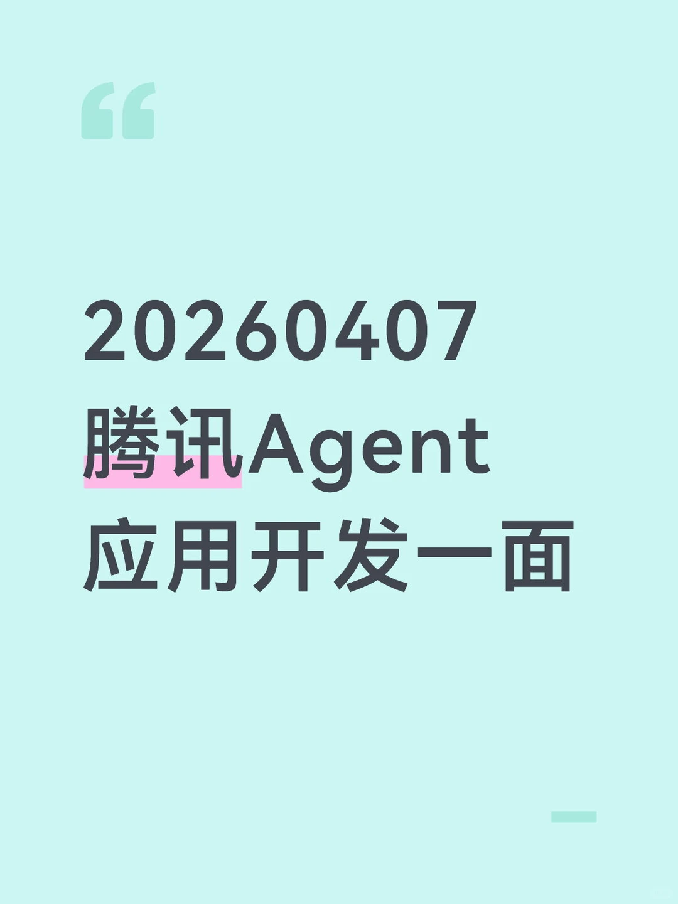

# 20260407腾讯Agent应用开发一面

## 摘要
该帖子详细记录了腾讯Agent应用开发岗位的一面面试问题，涵盖实习经历、项目细节（如Claude Code对比、分层上下文管理、GRPO与PPO区别、KL散度、Qlora设置等）、随机提问（AI工具使用、Agent开发难点、Prompt设计等）以及Python八股知识。内容详实，结构清晰，对准备AI/Agent相关面试的开发者有较高参考价值。

## 正文
## 0260407 腾讯 Agent 应用开发一面

### 一、实习

### 二、项目1

2.1 现在有了 Claude Code，为什么还要去重复的做一个类似的项目呢？

2.2 这个项目和 Claude Code 相比，核心差异是什么？有什么比他做的好，什么不如他？

2.3 分层上下文管理，每一层管的是什么？

2.4 摘要生成器使用什么模型做的？这个摘要质量要如何保证？

2.5 有没有尝试一下关于 subagent 的探索？启动多个 agent 的作用是什么？

2.6 主 agent 和子 agent 的通信是怎么实现的？

2.7 有没有遇到过 agent 陷入死循环的情况？有什么解决方案？

### 三、项目2

3.1 GRPO 和 PPO 的区别？

3.2 KL 散度，具体是怎么加入的？这个值太大或者太小有什么问题？

3.3 Qlora 的 rank 怎么设置的？

3.4 训练参数是怎么选的？有没有调参测试？

3.5 lora 和 qlora 的区别是什么？

3.6 量化之后对训练的效果影响是怎么样的？

3.7 梯度检查点的原理。它对训练速度大概减缓多少？

### 四、随机提问

4.1 平时用过哪些 AI agent 的工具？

4.2 你觉得 AI 工具，最大的帮助场景是什么？

4.3 有没有遇到过 AI 应用或者工具无法解决的场景？

4.4 平时写的代码或者实习写的代码有多少是 AI 生成的？

4.5 openclaw 有没有实际使用过？有没有做相关的了解？比如它的架构设计上的优势是什么？

4.6 你觉得类似于 openclaw 或者 Claude Code，它现在还有哪些地方是可以改进的？

4.7 Claude Code 源码泄露，有没有去了解它，有什么比较创新的东西？

4.8 从开发者的角度，做 agent 最难的部分是什么？

4.9 自己做 agent 的时候，踩过最大的坑是什么？

4.10 一个好的 prompt 和一个差的 prompt 的区别？

4.11 除了 Qwen3VL，还有没有使用过其他的多模态大模型？

4.12 有没有了解一些端侧部署的模型？

### 五、Python 八股

5.1 Python 中的深拷贝和浅拷贝的区别？

5.2 Python 中的修饰器知道吗？

5.3 Python 中的字典的底层原理？

5.4 死锁的条件是什么？

5.5 哈希表的原理？

---

【图片提取文字】

20260407 腾讯 Agent 应用开发一面

## 图片
- 

## 关键信息
- **实体**: 腾讯, Claude Code, GRPO, PPO, Qlora, Qwen3VL, OpenClaw, Python
- **情感**: neutral
- **质量评分**: 8.5/10

## 原文链接
[查看原文](https://www.xiaohongshu.com/explore/69d518300000000021038bb5)
