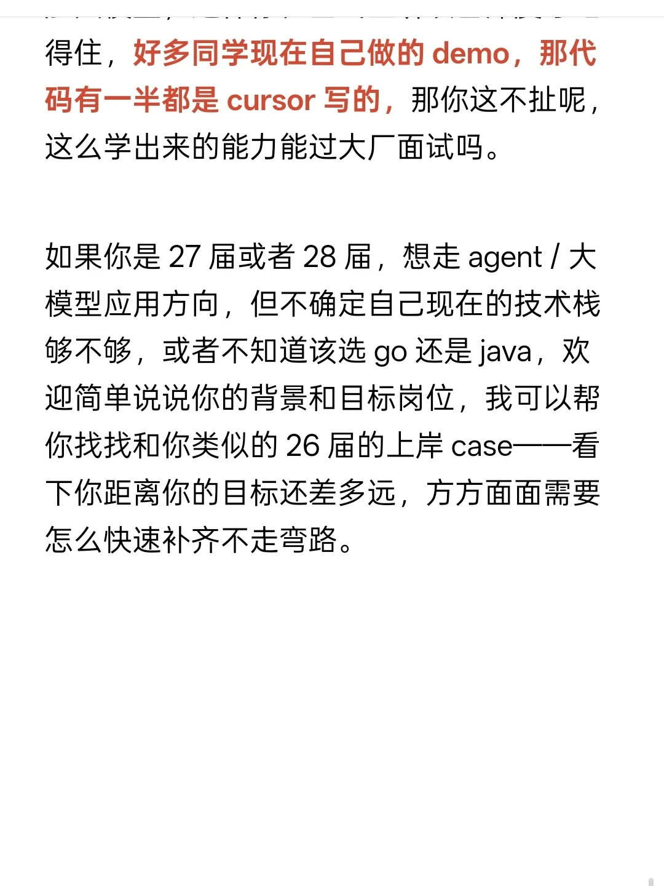
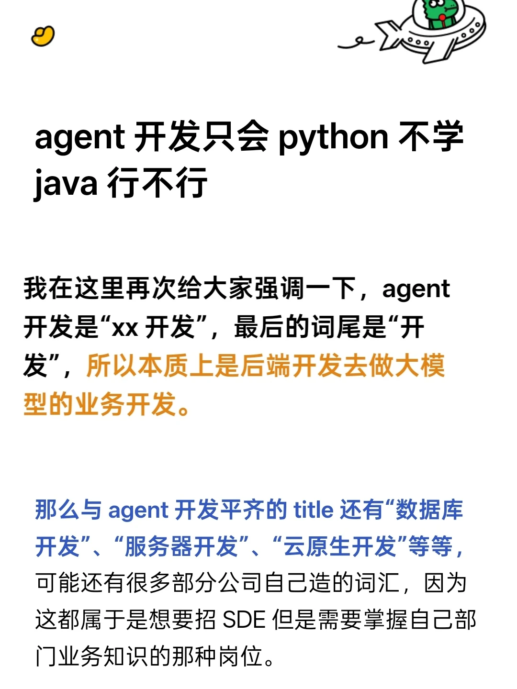
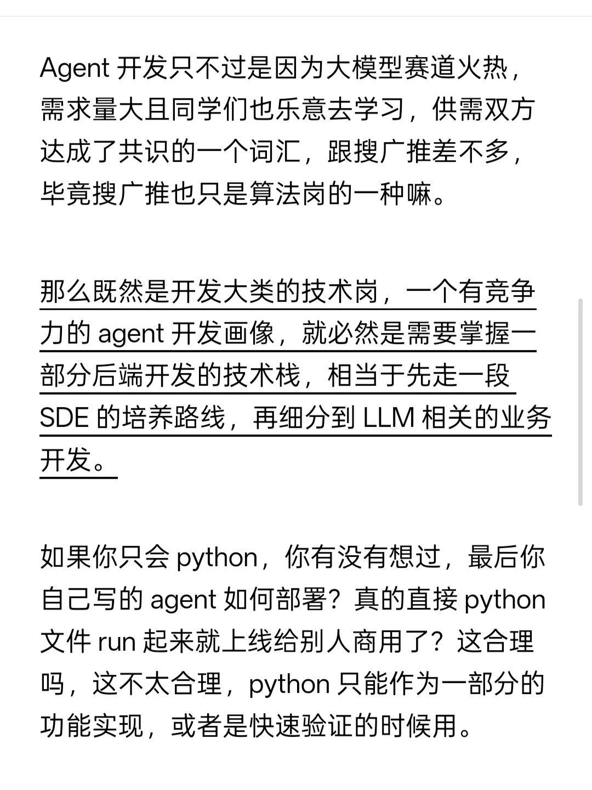
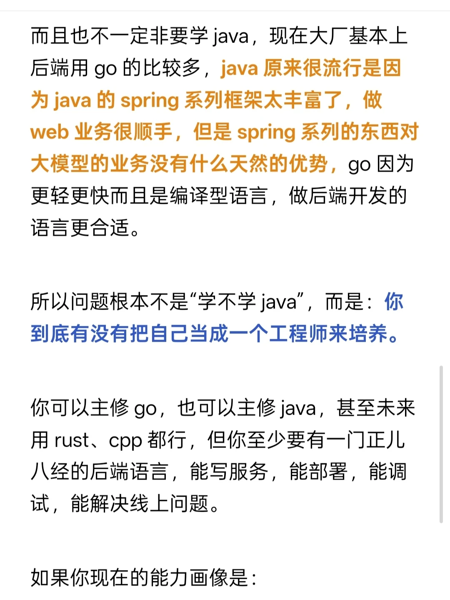
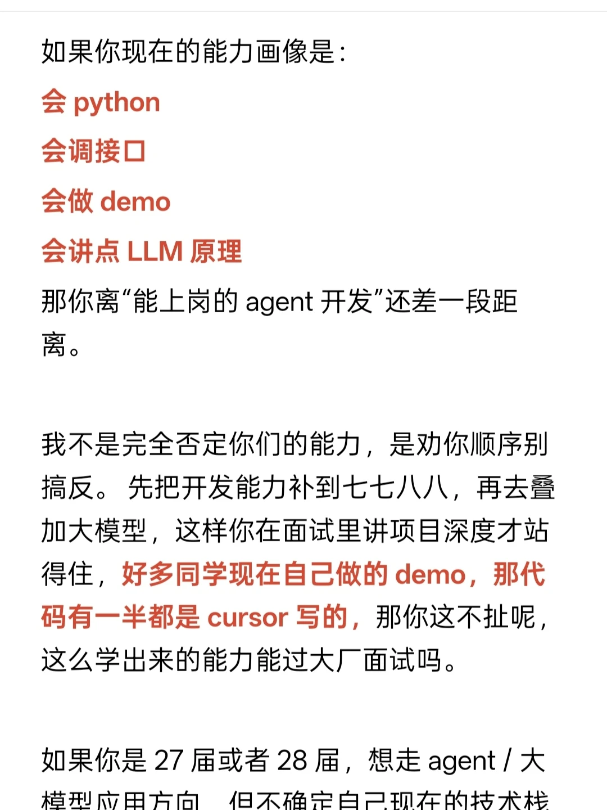

# agent 开发只会 python 不学 java 行不行

## 摘要
本文讨论了Agent开发的技术栈选择问题，强调Agent开发本质上是后端开发的一种，需要掌握后端技术栈（如Go、Java等）而不仅仅是Python。作者指出，Python适合快速验证和功能实现，但生产环境部署需要编译型语言。建议开发者先打好后端开发基础，再叠加LLM知识，才能具备竞争力。文章还对比了Go和Java在后端开发中的优劣，并针对27/28届学生给出了学习路径建议。

## 正文
## 正文

我在这里再次给大家强调一下，agent 开发是“xx 开发”，最后的词尾是“开发”，所以本质上是后端开发去做大模型的业务开发。

那么与 agent 开发平齐的 title 还有“数据库开发”、“服务器开发”、“云原生开发”等等，可能还有很多部分公司自己造的词汇，因为这都属于是想要招 SDE 但是需要掌握自己部门业务知识的那种岗位。

Agent 开发只不过是因为大模型赛道火热，需求量大且同学们也乐意去学习，供需双方达成了共识的一个词汇，跟搜广推差不多，毕竟搜广推也只是算法岗的一种嘛。

那么既然是开发大类的技术岗，一个有竞争力的 agent 开发画像，就必然是需要掌握一部分后端开发的技术栈，相当于先走一段 SDE 的培养路线，再细分到 LLM 相关的业务开发。

如果你只会 python，你有没有想过，最后你自己写的 agent 如何部署？真的直接 python 文件 run 起来就上线给别人商用了？这合理吗，这不太合理，python 只能作为一部分的功能实现，或者是快速验证的时候用。

而且也不一定非要学 java，现在大厂基本上后端用 go 的比较多，java 原来很流行是因为 java 的 spring 系列框架太丰富了，做 web 业务很顺手，但是 spring 系列的东西对大模型的业务没有什么天然的优势，go 因为更轻更快而且是编译型语言，做后端开发的语言更合适。

所以问题根本不是“学不学 java”，而是：你到底有没有把自己当成一个工程师来培养。

你可以主修 go，也可以主修 java，甚至未来用 rust、cpp 都行，但你至少要有一门正儿八经的后端语言，能写服务，能部署，能调试，能解决线上问题。

如果你现在的能力画像是：
- 会 python
- 会调接口
- 会做 demo
- 会讲点 LLM 原理

那你离“能上岗的 agent 开发”还差一段距离。

我不是完全否定你们的能力，是劝你顺序别搞反。先把开发能力补到七七八八，再去叠加大模型，这样你在面试里讲项目深度才站得住，好多同学现在自己做的 demo，那代码有一半都是 cursor 写的，那你这不扯呢，这么学出来的能力能过大厂面试吗。

如果你是 27 届或者 28 届，想走 agent / 大模型应用方向，但不确定自己现在的技术栈够不够，或者不知道该选 go 还是 java，欢迎简单说说你的背景和目标岗位，我可以帮你找找和你类似的 26 届的上岸 case....

## 评论区

**吃个雪糕8**
你们就开发吧 再开发开发 agent 用不了几年就会自己开发自己了
04-11 广东

**你也是小红薯**
还真没毛病，agent 开源越多，越促进 ai 写 agent
05-01 北京

**哈哈又胖了撒**
不懂行，但是 java 这个在我小时候就有了，可能上世纪就有了，居然还没被淘汰就特别觉得要是去学，学完它就会被淘汰了
04-15 上海

**弗雷尔卓德**
（无评论内容）

## 图片提取文字
得住，好多同学现在自己做的demo，那代
码有一半都是cursor写的，那你这不扯呢，
这么学出来的能力能过大厂面试吗。
如果你是27届或者28届，想走agent／大
模型应用方向，但不确定自己现在的技术栈
够不够，或者不知道该选 go还是java，欢
迎简单说说你的背景和目标岗位，我可以帮
你找找和你类似的26届的上岸case一一看
下你距离你的目标还差多远，方方面面需要
怎么快速补齐不走弯路。
agent开发只会python不学
java行不行
我在这里再次给大家强调一下，agent
开发是"xx开发”，最后的词尾是“开
发”，所以本质上是后端开发去做大模
型的业务开发。
那么与agent开发平齐的title还有“数据库
开发”、“服务器开发”、“云原生开发”等等，
可能还有很多部分公司自己造的词汇，因为
这都属于是想要招SDE但是需要掌握自己部
门业务知识的那种岗位。
Agent开发只不过是因为大模型赛道火热，
需求量大且同学们也乐意去学习，供需双方
达成了共识的一个词汇，跟搜厂推差不多，
毕竟搜广推也只是算法岗的一种嘛。
那么既然是开发大类的技术岗，一个有竞争
力的agent开发画像，就必然是需要掌握一
部分后端开发的技术栈，相当于先走一段
SDE的培养路线，再细分到LLM相关的业务
开发。
如果你只会 python，你有没有想过，最后你
自己写的agent如何部署？真的直接python
文件run起来就上线给别人商用了？这合理
吗，这不太合理，python只能作为一部分的
功能实现，或者是快速验证的时候用。
而且也不一定非要学java，现在大厂基本上
后端用go的比较多，java原来很流行是因
为java的spring系列框架太丰富了，做
web业务很顺手，但是spring系列的东西对
大模型的业务没有什么天然的优势，go因为
更轻更快而且是编译型语言，做后端开发的
语言更合适。
所以问题根本不是"学不学java”，而是：你
到底有没有把自己当成一个工程师来培养。
你可以主修go，也可以主修java，甚至未来
用rust、cpp 都行，但你至少要有一门正儿
八经的后端语言，能写服务，能部署，能调
试，能解决线上问题。
如果你现在的能力画像是：
如果你现在的能力画像是：
会python
会调接口
会做demo
会讲点LLM原理
那你离”能上岗的agent开发”还差一段距
离。
我不是完全否定你们的能力，是劝你顺序别
搞反。先把开发能力补到七七八八，再去叠
加大模型，这样你在面试里讲项目深度才站
得住，好多同学现在自己做的demo，那代
码有一半都是cursor写的，那你这不扯呢，
这么学出来的能力能过大厂面试吗。
如果你是27届或者28届，想走agent／大
模型应用方向，但不确定自己现在的技术栈
## 图片
- 
- 
- 
- 
- 

## 关键信息
- **实体**: Python, Java, Go, Rust, C++, Spring, LLM, SDE
- **情感**: neutral
- **质量评分**: 8.5/10

## 原文链接
[查看原文](https://www.xiaohongshu.com/explore/699d5d16000000000903b56e)
