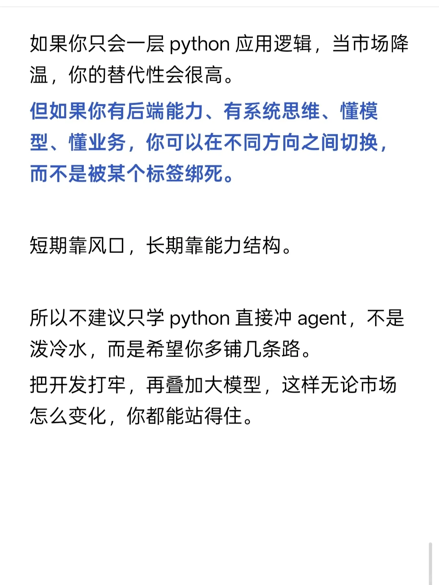
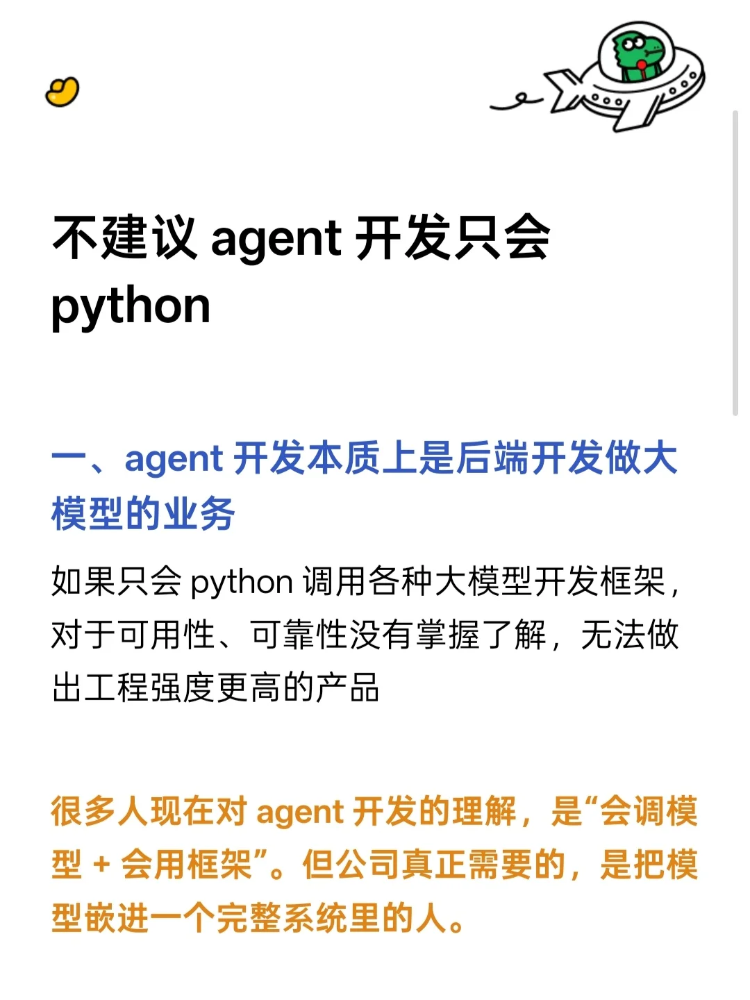
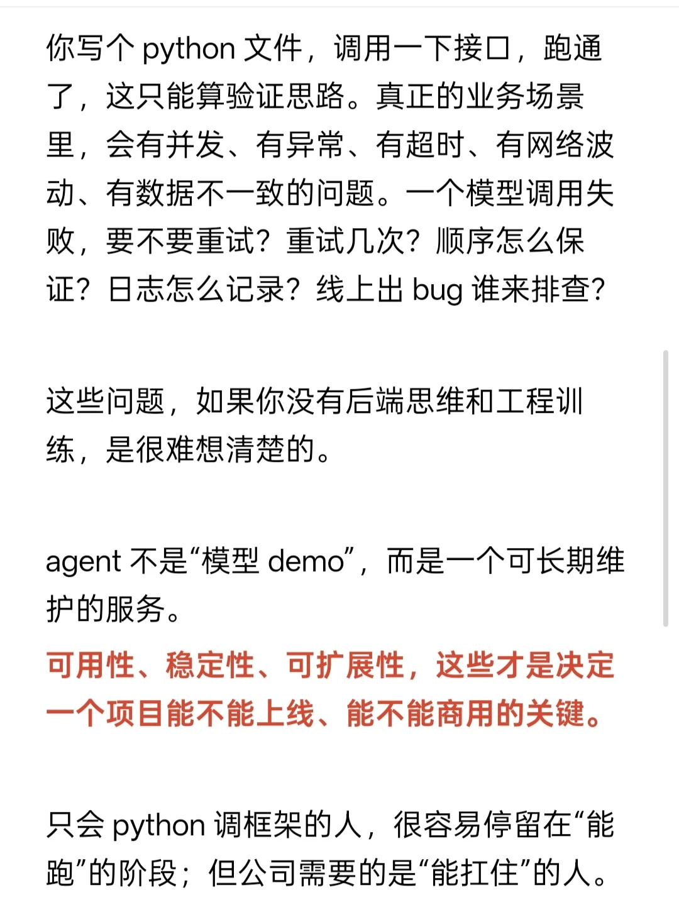
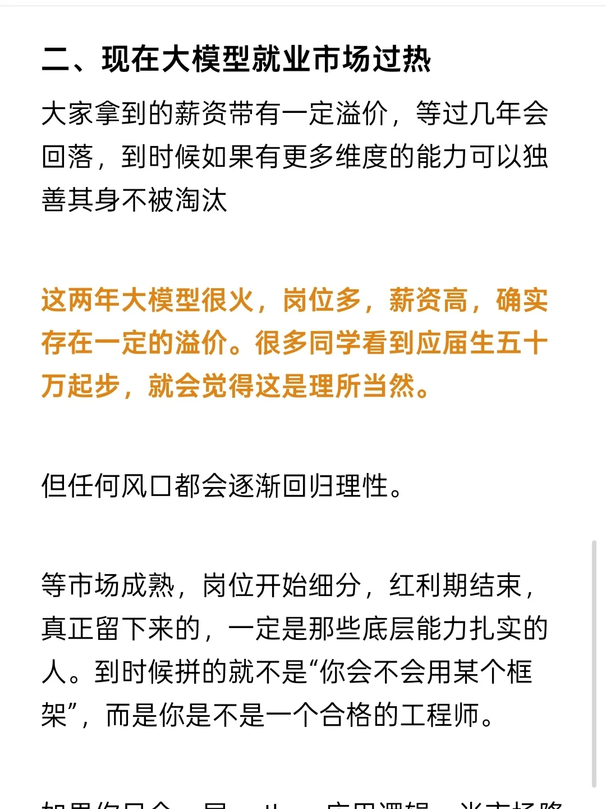

# 不建议 agent 开发只会 python

## 摘要
本文深入探讨了Agent开发中仅依赖Python的局限性，强调后端工程能力（如并发处理、异常管理、系统稳定性）在构建可商用Agent服务中的核心作用。作者指出当前大模型就业市场存在薪资溢价，长期来看，具备后端思维、系统设计和多语言能力的工程师更具竞争力。文章建议开发者不要局限于Python，而应夯实后端基础，叠加模型知识，以应对市场变化。

## 正文
## 一、agent 开发本质上是后端开发做大模型的业务

如果只会 Python 调用各种大模型开发框架，对于可用性、可靠性没有掌握了解，无法做出工程强度更高的产品。

很多人现在对 agent 开发的理解，是“会调模型 + 会用框架”。但公司真正需要的，是把模型嵌进一个完整系统里的人。

你写个 Python 文件，调用一下接口，跑通了，这只能算验证思路。真正的业务场景里，会有并发、有异常、有超时、有网络波动、有数据不一致的问题。一个模型调用失败，要不要重试？重试几次？顺序怎么保证？日志怎么记录？线上出 bug 谁来排查？

这些问题，如果你没有后端思维和工程训练，是很难想清楚的。

agent 不是“模型 demo”，而是一个可长期维护的服务。

可用性、稳定性、可扩展性，这些才是决定一个项目能不能上线、能不能商用的关键。

只会 Python 调框架的人，很容易停留在“能跑”的阶段；但公司需要的是“能扛住”的人。

## 二、现在大模型就业市场过热

大家拿到的薪资带有一定溢价，等过几年会回落，到时候如果有更多维度的能力可以独善其身不被淘汰。

这两年大模型很火，岗位多，薪资高，确实存在一定的溢价。很多同学看到应届生五十万起步，就会觉得这是理所当然。

但任何风口都会逐渐回归理性。

等市场成熟，岗位开始细分，红利期结束，真正留下来的，一定是那些底层能力扎实的人。到时候拼的就不是“你会不会用某个框架”，而是你是不是一个合格的工程师。

如果你只会一层 Python 应用逻辑，当市场降温，你的替代性会很高。

但如果你有后端能力、有系统思维、懂模型、懂业务，你可以在不同方向之间切换，而不是被某个标签绑死。

短期靠风口，长期靠能力结构。

所以不建议只学 Python 直接冲 agent，不是泼冷水，而是希望你多铺几条路。

把开发打牢，再叠加大模型，这样无论市场怎么变化，你都能站得住。

---

## 评论区

- **用户1**：现在精通 Java + Python 才是企业所需的人  
  03-01 广东

- **南畔雨压星河**：go 一样的，只是后端思想，反而 go 还更合适  
  03-06 北京

- **kkl**：都 vibe coding 了啥语言不一样  
  03-11 重庆

- **Neo | 大模型转型诊断**：（无评论内容）

## 图片
- 
- 
- 
- 

## 关键信息
- **实体**: Python, Java, Go, 字节跳动, 大模型, Agent
- **情感**: neutral
- **质量评分**: 8.5/10

## 原文链接
[查看原文](https://www.xiaohongshu.com/explore/69a3163e000000002602d1bb)
