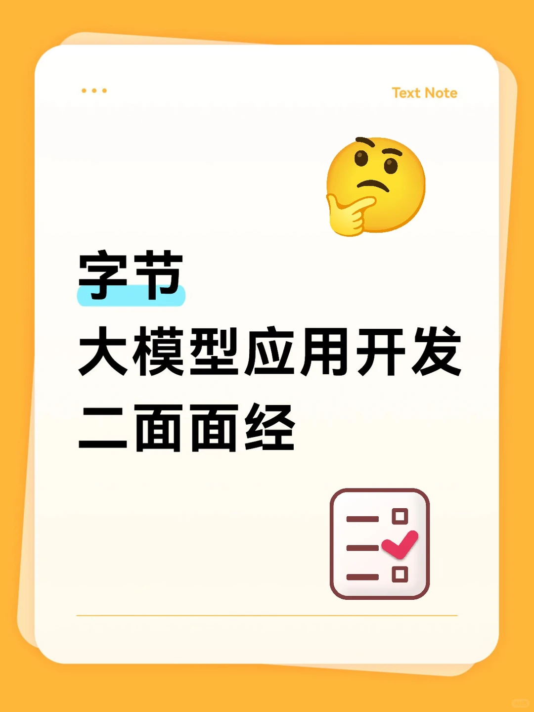

# 字节 大模型应用开发 二面面经

## 摘要
这是一篇字节跳动日常实习（RAG方向）的二面面经，详细记录了面试中涉及的20个技术问题，涵盖RAG架构、向量检索、模型推理、异步编程、多线程处理、JSON输出控制等大模型应用开发核心知识点。面试官背景为RAG方向，问题深入且具有实战性，包括项目拷打、场景题和手撕代码。帖子还包含评论区互动，反映了面试难度和结果。内容详实，对准备大模型相关面试的读者有较高参考价值。

## 正文
## 面试题整理：字节跳动日常实习（RAG方向）

**时间**：72分钟  
**面试官背景**：之前做RAG，因此RAG相关问题较多  

### 正文

1. **自我介绍**  
2. **项目一拷打**：工业PDF一般图文分离，你是如何实现版面解析并保留文档逻辑结构的？多模态检索的视觉和文本是如何在向量空间内实现对齐的？  
3. **项目二拷打**：针对长短期记忆，讲讲你是如何设计记忆的提取、压缩与冲突更新机制的？如果检测到用户存在极端情绪，你的Agent如何在不中断对话流的前提下进行干预？  
4. 在向量化之前，为什么要对长文档进行切片？如果不切片会有什么后果？  
5. 切片时设置重叠区域的作用是什么？这个比例你通常怎么来确定？  
6. 讲一下稠密向量与稀疏向量的区别，分别适合处理什么样的搜索需求？  
7. 向量库检索出的Top-K结果，如果K值设置得过大，对后续的生成质量有哪些负面影响？  
8. 余弦相似度和欧氏距离在衡量文本相似性时，各自的优缺点是什么？  
9. 为什么在初筛召回之后，还要加一个Rerank模型？它能解决向量搜索的哪些局限？  
10. 如果文档发生了局部更新，如何通过增量索引来避免全量重新向量化？  
11. 在RAG的生成阶段，如何在Prompt中设定边界条件来防止模型在没搜到内容时产生幻觉？  
12. 了解HyDE吗？介绍一下原理，它在处理模糊提问时有哪些优势？  
13. 随着超长上下文模型的出现，你认为传统RAG架构的必要性是否降低了？  
14. 你了解哪些大模型推理框架？SGLang相比vLLM的PagedAttention在推理延迟上有哪些优势？  
15. 调用大模型API时，为什么要使用asyncio异步编程？它在处理高并发请求时有何优势？  
16. 针对大规模PDF解析这种任务，你选择多线程还是多进程？  
17. 如何确保Agent返回的结果是标准的JSON格式？如果模型输出中有多余的说明文字，你在后端如何提取？  
18. **场景题**：对于RAG，如果检索到了针对同一故障的两份手册，内容相互冲突，请你设计一套逻辑，让模型能够识别冲突并优先选择时效性更高的信息？  
19. **手撕代码**：第k大元素  
20. **反问**  

**结果**：面完后几天挂了，后面又换了个部门面。

---

### 评论区

**kkk**  
主包答出来多少呀？  
03-19 广东  

**Devs**  
学弟说他基本都回答了，但是有的题答得不太全  
03-19 北京  

**邦迪柠檬**  
请问字节agent开发有笔试吗  
03-21 江苏  

**Devs**  
（无内容）

## 图片
- 

## 关键信息
- **实体**: 字节跳动, RAG, HyDE, SGLang, vLLM, PagedAttention, asyncio, 第k大元素
- **情感**: neutral
- **质量评分**: 9.0/10

## 原文链接
[查看原文](https://www.xiaohongshu.com/explore/69ba757c000000002800b28f)
