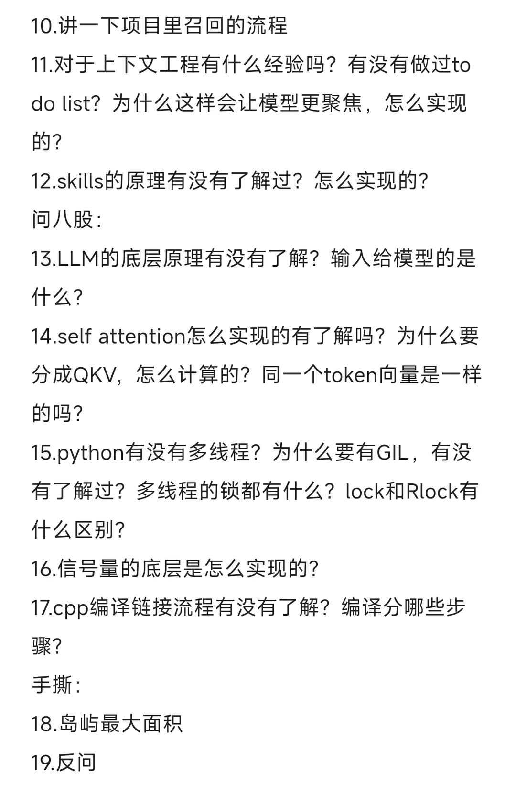
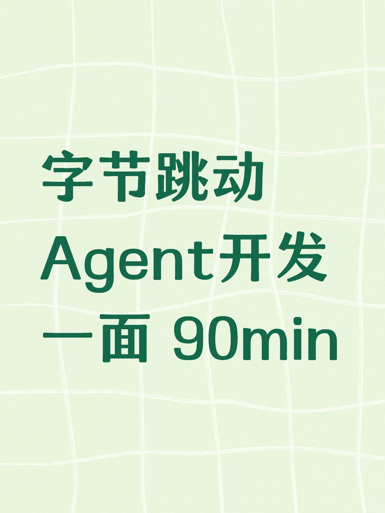
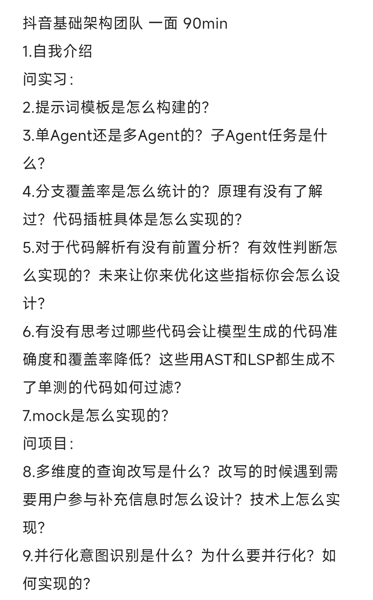

# 字节跳动Agent开发一面

## 摘要
该帖子详细记录了字节跳动抖音基础架构团队Agent开发岗位的一面面试经历，时长90分钟。面试内容涵盖自我介绍、实习项目（如提示词模板构建、多Agent设计、代码覆盖率统计、mock实现）、项目经验（查询改写、意图识别、上下文工程）、八股文（LLM原理、self-attention、Python多线程与GIL、C++编译链接）以及手撕代码（岛屿最大面积）。帖子还包含评论区互动，反映了面试深度和求职者反馈。整体内容详实，对准备AI/机器学习或后端开发面试的读者有较高参考价值。

## 正文
## 抖音基础架构团队 一面 90min

### 自我介绍
1. 自我介绍

### 实习相关
2. 提示词模板是怎么构建的？
3. 单Agent还是多Agent的？子Agent任务是什么？
4. 分支覆盖率是怎么统计的？原理有没有了解过？代码插桩具体是怎么实现的？
5. 对于代码解析有没有前置分析？有效性判断怎么实现的？未来让你来优化这些指标你会怎么设计？
6. 有没有思考过哪些代码会让模型生成的代码准确度和覆盖率降低？这些用AST和LSP都生成不了单测的代码如何过滤？
7. mock是怎么实现的？

### 项目相关
8. 多维度的查询改写是什么？改写的时候遇到需要用户参与补充信息时怎么设计？技术上怎么实现？
9. 并行化意图识别是什么？为什么要并行化？如何实现的？
10. 讲一下项目里召回的流程
11. 对于上下文工程有什么经验吗？有没有做过to do list？为什么这样会让模型更聚焦，怎么实现的？
12. skills的原理有没有了解过？怎么实现的？

### 八股文
13. LLM的底层原理有没有了解？输入给模型的是什么？
14. self attention怎么实现的有了解吗？为什么要分成QKV，怎么计算的？同一个token向量是一样的吗？
15. python有没有多线程？为什么要有GIL，有没有了解过？多线程的锁都有什么？lock和Rlock有什么区别？
16. 信号量的底层是怎么实现的？
17. cpp编译链接流程有没有了解？编译分哪些步骤？

### 手撕代码
18. 岛屿最大面积

### 反问
19. 反问

3.16更新：已挂

---

## 评论区

**瓜农在线吃瓜**  
这问得也太深了吧  
03-14 浙江

**瓜农在线吃瓜**  
从开发到算法到编程语言全都问了  
03-14 浙江

**啊喂**  
想问问 agent开发不会java能行吗  
03-16 广东

**咕噜噜**

## 图片提取文字
（无）

## 图片
- 
- 
- 

## 关键信息
- **实体**: 字节跳动, 抖音, 基础架构团队, Agent开发
- **情感**: neutral
- **质量评分**: 8.5/10

## 原文链接
[查看原文](https://www.xiaohongshu.com/explore/69b4daa5000000001b020dc1)
