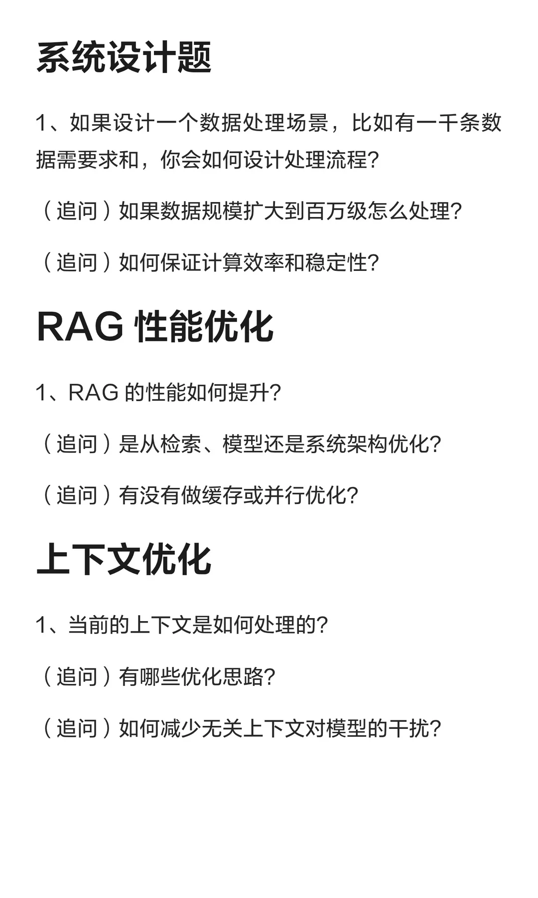
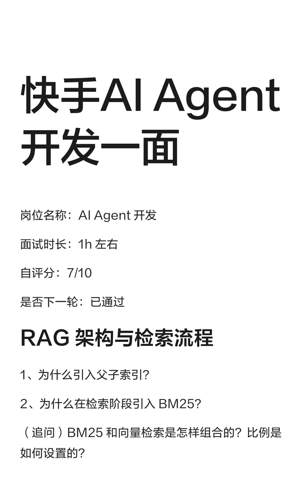
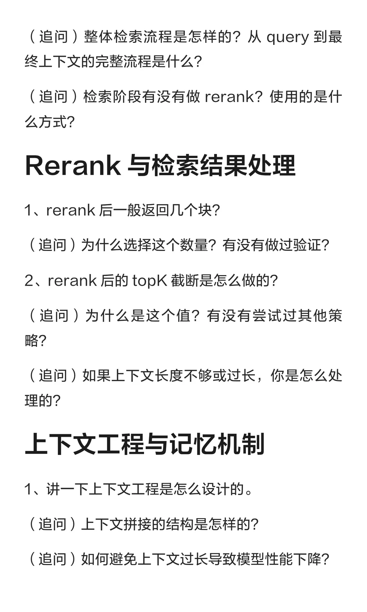
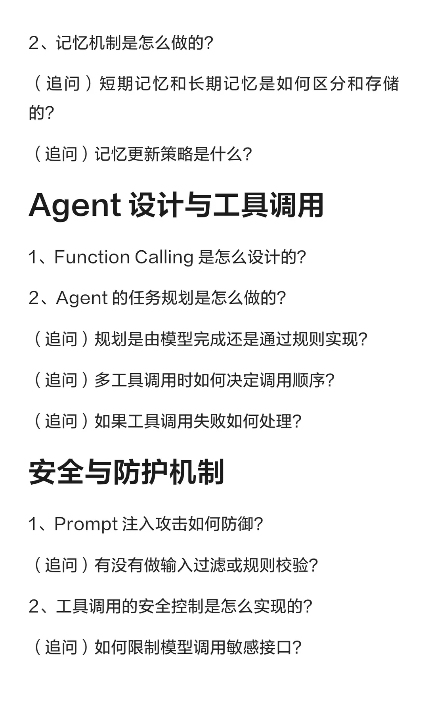
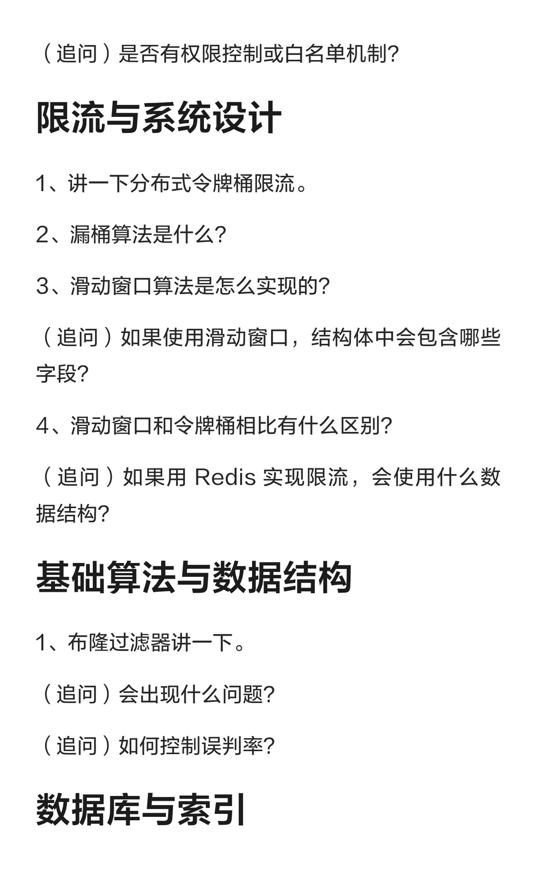
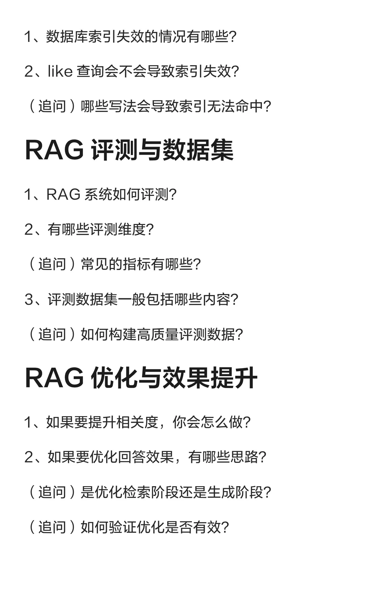

# 快手AI Agent开发一面

## 摘要
该帖子详细记录了快手AI Agent开发岗位的一面面试经历，涵盖了RAG架构、检索流程、Rerank、上下文工程、记忆机制、Agent设计、工具调用、安全防护、限流算法、数据库索引、RAG评测与优化等多个技术领域。面试问题深入且系统，涉及从理论到实践的多个层面，如父子索引、BM25与向量检索的组合、分布式令牌桶限流、布隆过滤器等。帖子内容详实，结构清晰，对准备AI/机器学习相关面试的读者具有很高的参考价值。

## 正文
## 快手 AlAgent 开发一面

- **岗位名称**：AlAgent 开发
- **面试时长**：1h 左右
- **自评分**：7/10
- **是否下一轮**：已通过

---

### RAG 架构与检索流程

1. **为什么引入父子索引？**
2. **为什么在检索阶段引入 BM25？**
   - （追问）BM25 和向量检索是怎样组合的？比例是如何设置的？
   - （追问）整体检索流程是怎样的？从 query 到最终上下文的完整流程是什么？
   - （追问）检索阶段有没有做 rerank？使用的是什麼方式？

### Rerank 与检索结果处理

1. **rerank 后一般返回几个块？**
   - （追问）为什么选择这个数量？有没有做过验证？
2. **rerank 后的 topK 截断是怎么做的？**
   - （追问）为什么是这个值？有没有尝试过其他策略？
   - （追问）如果上下文长度不够或过长，你是怎么处理的？

### 上下文工程与记忆机制

1. **讲一下上下文工程是怎么设计的。**
   - （追问）上下文拼接的结构是怎样的？
   - （追问）如何避免上下文过长导致模型性能下降？
2. **记忆机制是怎么做的？**
   - （追问）短期记忆和长期记忆是如何区分和存储的？
   - （追问）记忆更新策略是什么？

### Agent 设计与工具调用

1. **Function Calling 是怎么设计的？**
2. **Agent 的任务规划是怎么做的？**
   - （追问）规划是由模型完成还是通过规则实现？
   - （追问）多工具调用时如何决定调用顺序？
   - （追问）如果工具调用失败如何处理？

### 安全与防护机制

1. **Prompt 注入攻击如何防御？**
   - （追问）有没有做输入过滤或规则校验？
2. **工具调用的安全控制是怎么实现的？**
   - （追问）如何限制模型调用敏感接口？
   - （追问）是否有权限控制或白名单机制？

### 限流与系统设计

1. **讲一下分布式令牌桶限流。**
2. **漏桶算法是什么？**
3. **滑动窗口算法是怎么实现的？**
   - （追问）如果使用滑动窗口，结构体中会包含哪些字段？
4. **滑动窗口和令牌桶相比有什么区别？**
   - （追问）如果用 Redis 实现限流，会使用什么数据结构？

### 基础算法与数据结构

1. **布隆过滤器讲一下。**
   - （追问）会出现什么问题？
   - （追问）如何控制误判率？

### 数据库与索引

1. **数据库索引失效的情况有哪些？**
2. **like 查询会不会导致索引失效？**
   - （追问）哪些写法会导致索引无法命中？

### RAG 评测与数据集

1. **RAG 系统如何评测？**
2. **有哪些评测维度？**
   - （追问）常见的指标有哪些？
3. **评测数据集一般包括哪些内容？**
   - （追问）如何构建高质量评测数据？

### RAG 优化与效果提升

1. **如果要提升相关度，你会怎么做？**
2. **如果要优化回答效果，有哪些思路？**
   - （追问）是优化检索阶段还是生成阶段？
   - （追问）如何验证优化是否有效？

### 系统设计题

1. **如果设计一个数据处理场景，比如有一千条数据需要求和，你会如何设计处理流程？**
   - （追问）如果数据规模扩大到百万级怎么处理？
   - （追问）如何保证计算效率和稳定性？

### RAG 性能优化

1. **RAG 的性能如何提升？**
   - （追问）是从检索、模型还是系统架构优化？
   - （追问）有没有做缓存或并行优化？

### 上下文优化

1. **当前的上下文是如何处理的？**
   - （追问）有哪些优化思路？
   - （追问）如何减少无关上下文对模型的干扰？

---

## 评论区

**晓月**  
这些 agent 八股都是在哪里看的呀  
04-02 河北

**Offer面试官**  
不是八股合集那种，这些都是我们的在职面试官按春招真实面试整理的  
04-05 上海

**AAA专业猫狗鼻子补漆**  
为什么大部分 agent 都是结合后端呢[抽泣R][抽泣R][抽泣R]有没有结合前端的哇，小白刚开始学前端，感觉后端太多太难了，有没有大佬可以解答一下  
03-26 重庆

**Offer面试官**  
（无回复内容）

## 图片
- 
- 
- 
- 
- 
- 

## 关键信息
- **实体**: 快手, AI Agent, RAG, BM25, 布隆过滤器, Redis
- **情感**: neutral
- **质量评分**: 9.0/10

## 原文链接
[查看原文](https://www.xiaohongshu.com/explore/69b65422000000001a0312bc)
