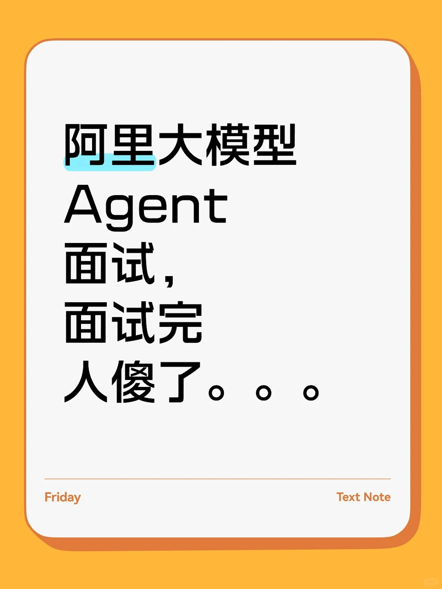

# 阿里大模型Agent面试，面试完人傻了。。。

## 摘要
该帖子详细记录了阿里大模型Agent岗位的面试经历，重点围绕Agent核心技术模块（规划、感知、工具、记忆）的功能、难点及联动逻辑展开，并探讨了微调、提示工程与Agent算法设计的关系。内容结构清晰，包含具体技术细节和实战经验，对求职者具有较高参考价值。

## 正文
阿里大模型Agent面试，面试完人傻了。。。
一面：基础广度与代码硬功
面试官是个声音很温和的哥哥，开场常规自我介绍后，直接切入正题。
“你对大模型Agent的核心技术模块怎么理解？每个模块的功能、难点，以及它们之间怎么联动？”
这个问题看似基础，实则是想看你有没有真正动手搭过Agent系统。我当时在脑子里快速画了个图：
Agent的核心模块，我把它拆成大脑（规划）、五官（感知）、手脚（工具）、记忆（记忆）四个部分。
规划模块是决策中心，难点在于任务拆解的合理性。比如让Agent订机票，是直接调API还是先查航班再比价？拆解错了，后面全错。
感知模块负责理解环境反馈。难点是多模态信息的对齐，网页返回的JSON和用户说的自然语言怎么融合？
工具模块是执行层。难点在于工具选择的准确性和调用参数的规范性。你让Agent调用天气API，它得知道把“明天”转成具体日期。
记忆模块串联整个流程。短期记忆保证多轮对话不跑偏，长期记忆让Agent记住你的偏好。难点是记忆的检索效率和遗忘策略。
这四个模块的联动逻辑是：感知输入 -> 大脑规划 -> 记忆检索 -> 工具调用 -> 结果反馈 -> 记忆更新，形成一个闭环。
“那微调、提示工程和Agent算法设计之间是什么关系？”
这个问题我理解是在考察技术选型能力。我的回答是：三者是不同颗粒度的干预手段。
提示工程是“现场指挥”，在推理时给Agent明确的指令和范例，成本低但效果不稳定，适合简单任务。
微调是“长期训练”，让模型从根本上学会某种行为模式。比如我们之前做金融问答Agent，直接提示词总是搞不定专业术语，微调了一批财报数据后，准确率直接提升25%。

## 图片提取文字
（无）

## 图片
- 

## 关键信息
- **实体**: 阿里, Agent, 大模型, 微调, 提示工程
- **情感**: neutral
- **质量评分**: 8.5/10

## 原文链接
[查看原文](https://www.xiaohongshu.com/explore/69b4139000000000210050a4)
