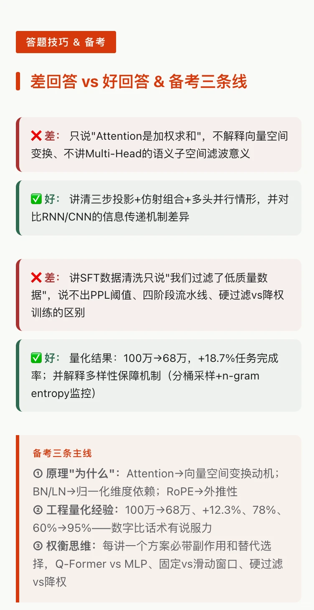
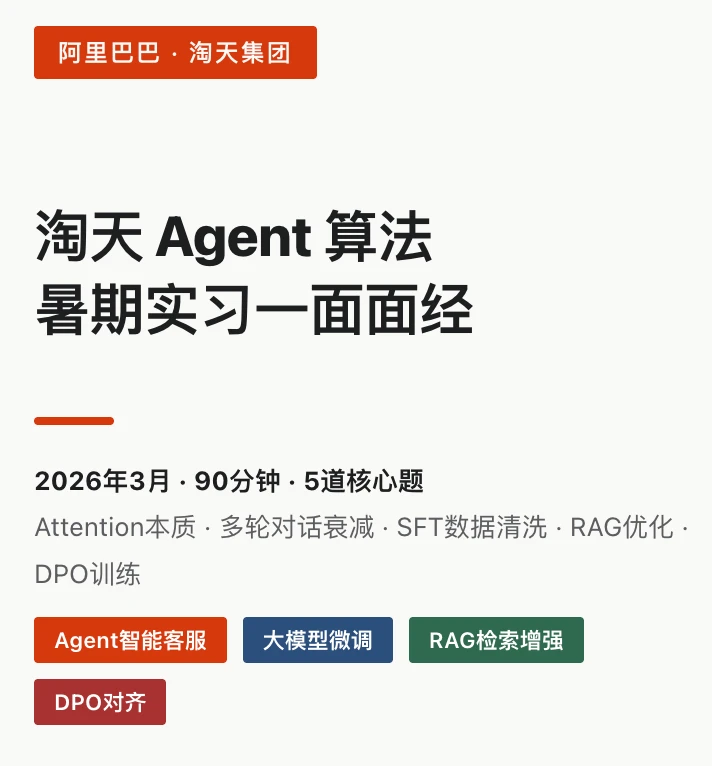
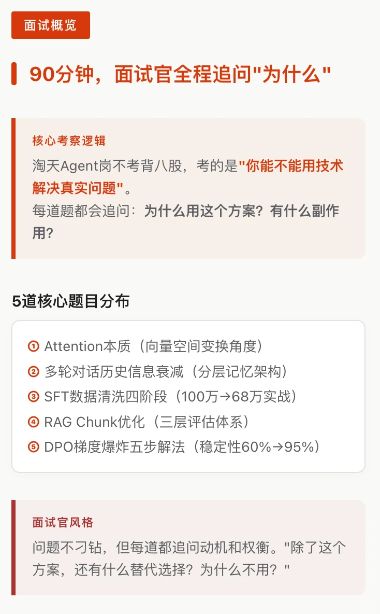
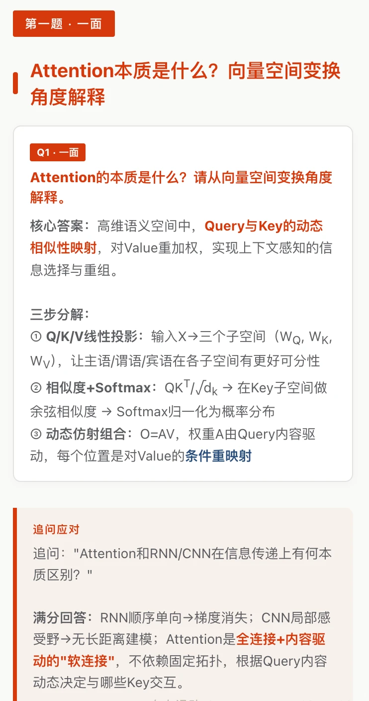
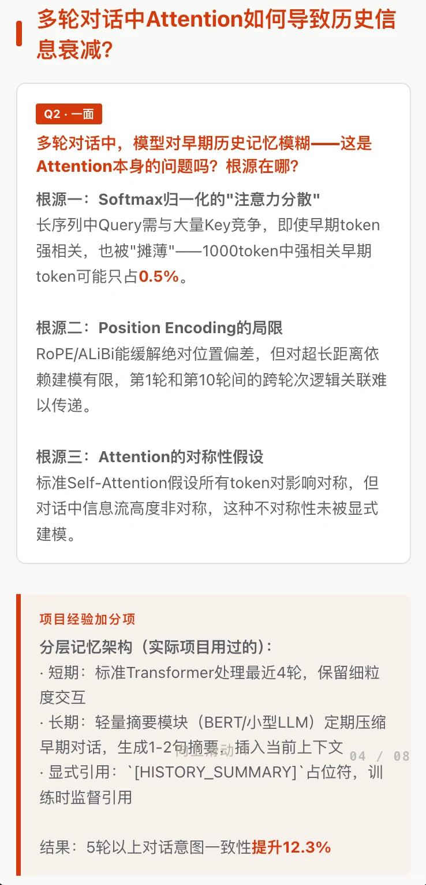
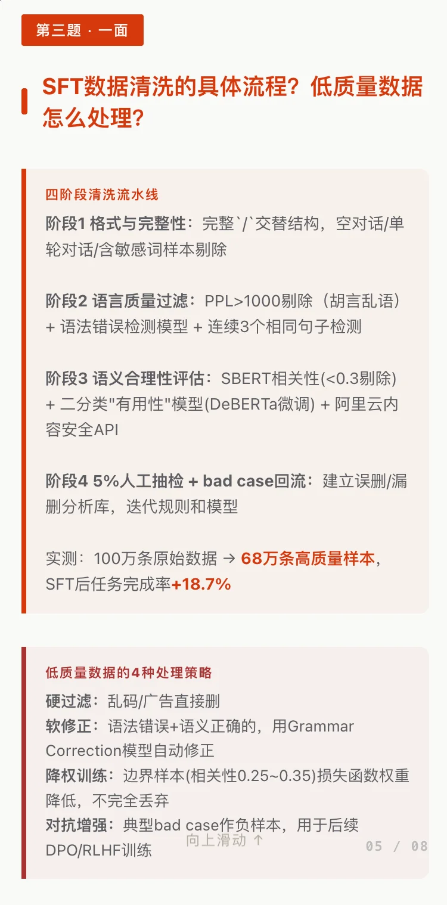
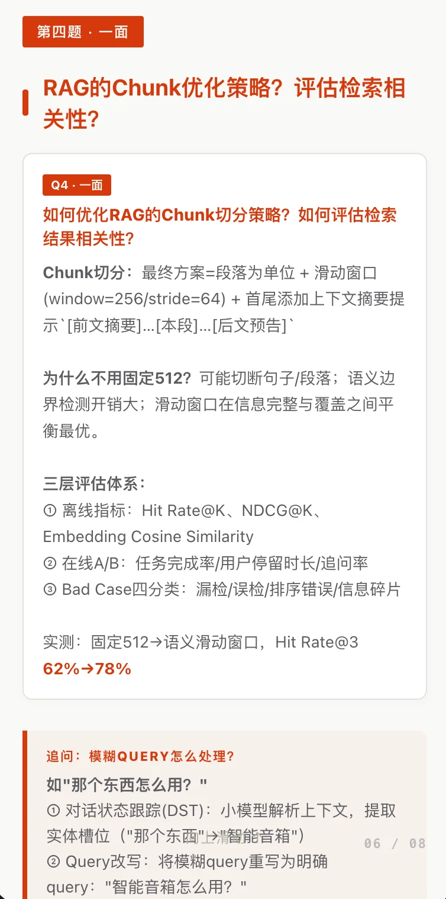
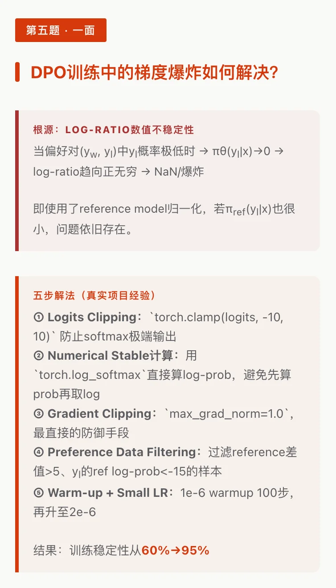

# 阿里淘天暑期实习Agent算法岗一面

## 摘要
该帖子详细记录了阿里淘天集团暑期实习Agent算法岗的面试经历，涵盖了Attention机制、多轮对话中的历史信息衰减、SFT数据清洗流程、RAG的chunk优化策略以及DPO训练中梯度爆炸的解决方案等核心问题。内容专业且深入，提供了具体的算法原理和实战经验，对准备大模型相关岗位面试的读者具有很高的参考价值。

## 正文
## 淘天集团 · Agent智能客服方向

### 核心题目

1. **Attention本质是什么？请从向量空间变换角度解释**
   本质是高维语义空间中 Query 与 Key 的动态相似性映射，对 Value 重加权实现上下文感知的信息选择与重组。三步：①Q/K/V线性投影到子空间 ②QK^T/√dk计算相似度+Softmax归一化 ③AV动态仿射组合。

2. **多轮对话中Attention如何导致历史信息衰减？**
   两大根源：①Softmax归一化的"注意力分散"——长序列中强相关早期token被大量无关Key摊薄（如1000token中仅占0.5%） ②Position Encoding局限——超长距离依赖建模有限，RoPE/ALiBi缓解但未根治。

3. **SFT数据清洗的具体流程？遇到低质量数据怎么处理？**
   四阶段：①格式完整性校验 ②语言质量过滤 ③语义合理性评估（SBERT相关性+二分类有用性模型+安全API） ④5%人工抽检+bad case回流。低质量数据处理：硬过滤（乱码广告直接删）/ 软修正（Grammar Correction）/ 降权训练（边界样本权重降低）/ 对抗增强（bad case做负样本）

4. **RAG的chunk优化策略有哪些？怎么评估检索相关性？**
   最终方案：段落为单位+滑动窗口（window=256/stride=64）+首尾添加上下文摘要提示。

5. **DPO训练中梯度爆炸如何解决？（一面）**
   根源：log-ratio项数值不稳定（πθ(yl)→0导致log-ratio趋向无穷）。五步解法：①Logits Clipping（clamp到±10） ②Numerical Stable计算（torch.log_softmax避免先prob再log） ③Gradient Clipping（max_norm=1.0） ④Preference Data Filtering（过滤reference差值>5的样本） ⑤Warm-up+Small LR（1e-6 warmup 100步→2e-6）。β调参经验：太小（0.1）不学习偏好，太大（10）过拟合→最佳区间0.5~2.0，β=1.0验证集最优。训练稳定性从60%→95%。

---

### 评论区

- **铁锈味的日落**：太假 05-01美国
- **学长学姐帮**：持续进步 05-01广东

- THE END -

## 图片提取文字
（无）

## 图片
- 
- 
- 
- 
- 
- 
- 
- 

## 关键信息
- **实体**: 淘天集团, Agent智能客服, Attention, SFT, RAG, DPO, RoPE, ALiBi, SBERT
- **情感**: positive
- **质量评分**: 9.0/10

## 原文链接
[查看原文](https://www.xiaohongshu.com/explore/69dbbf4b000000001a02a430)
