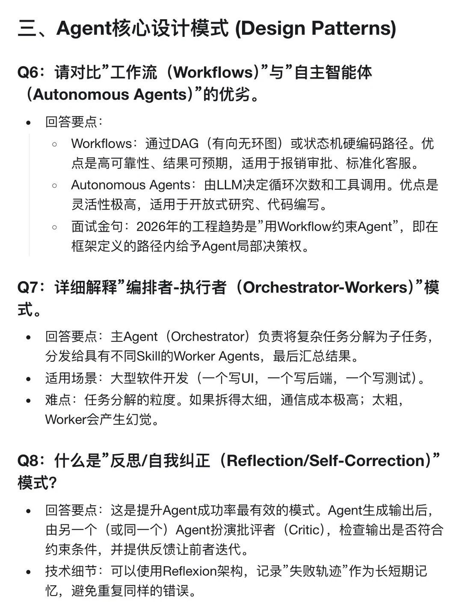
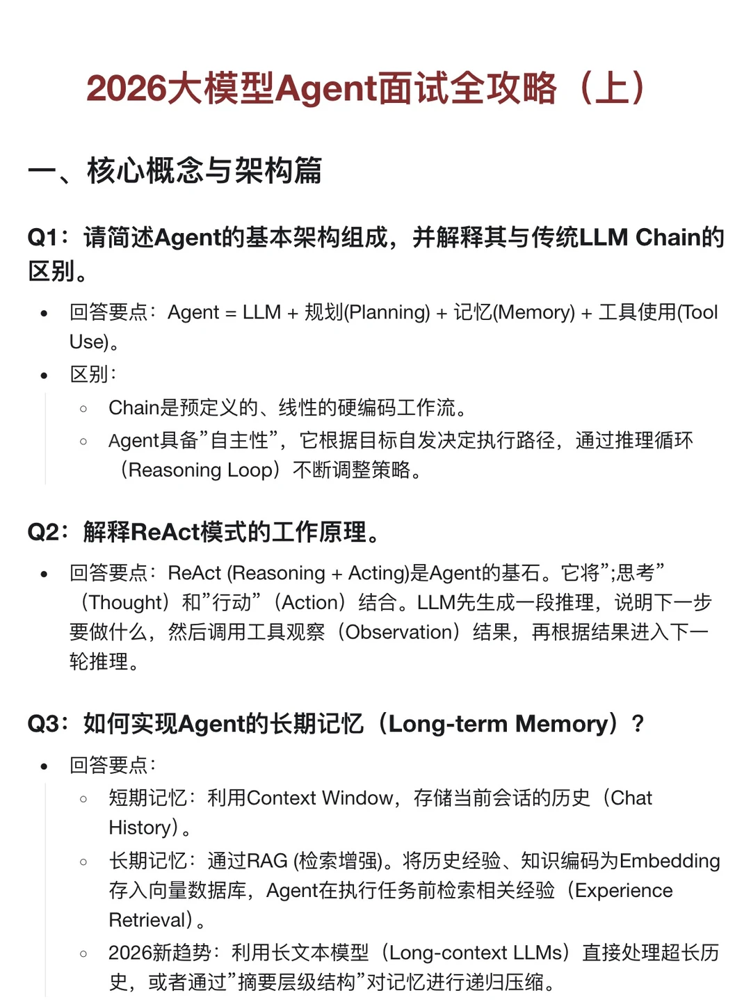

# 2026大模型Agent面试全攻略（上）

## 摘要
一、核心概念与架构篇
Q1：请简述Agent的基本架构组成，并解释其与传统LLM Chain的区别。
回答要点：Agent = LLM + 规划(Planning) + 记忆(Memory) + 工具使用(Tool Use)。
区别：
Chain是预定义的、线性的硬编码工作流。
Agent具备”自主性”，它根据目标自发决定执行路径，通过推理循环（Reasoning Loop）不断调整策略。
Q2：

## 正文
一、核心概念与架构篇
Q1：请简述Agent的基本架构组成，并解释其与传统LLM Chain的区别。
回答要点：Agent = LLM + 规划(Planning) + 记忆(Memory) + 工具使用(Tool Use)。
区别：
Chain是预定义的、线性的硬编码工作流。
Agent具备”自主性”，它根据目标自发决定执行路径，通过推理循环（Reasoning Loop）不断调整策略。
Q2：解释ReAct模式的工作原理。
回答要点：ReAct (Reasoning + Acting)是Agent的基石。它将”;思考”（Thought）和”行动”（Action）结合。LLM先生成一段推理，说明下一步要做什么，然后调用工具观察（Observation）结果，再根据结果进入下一轮推理。
Q3：如何实现Agent的长期记忆（Long-term Memory）？
回答要点：
短期记忆：利用Context Window，存储当前会话的历史（Chat History）。
长期记忆：通过RAG (检索增强)。将历史经验、知识编码为Embedding存入向量数据库，Agent在执行任务前检索相关经验（Experience Retrieval）。
2026新趋势：利用长文本模型（Long-context LLMs）直接处理超长历史，或者通过”摘要层级结构”对记忆进行递归压缩。

【评论】
天生好命且富贵福相的幸运贵妇富婆女神
可以求资料嘛
04-07北京
AI实战领航员
都在这里了哈
04-07浙江
Terry
已关 求资料
03-15法国
AI实战领航员

## 图片提取文字
三、Agent核心设计模式（DesignPatterns)
）
(Autonomous Agents)"的优劣。
·回答要点：
Workflows：通过DAG（有向无环图）或状态机硬编码路径。优
点是高可靠性、结果可预期，适用于报销审批、标准化客服。
AutonomousAgents：由LLM决定循环次数和工具调用。优点是
灵活性极高，适用于开放式研究、代码编写。
面试金句：2026年的工程趋势是”用Workflow约束Agent”，即在
框架定义的路径内给予Agent局部决策权。
Q7：详细解释”编排者-执行者（Orchestrator-Workers）”模
式。
·回答要点：主Agent（Orchestrator）负责将复杂任务分解为子任务，
分发给具有不同Skill的WorkerAgents，最后汇总结果。
·适用场景：大型软件开发（一个写UI，一个写后端，一个写测试）。
·难点：任务分解的粒度。如果拆得太细，通信成本极高；太粗，
Worker会产生幻觉。
Q8：什么是”反思/自我纠正（Reflection/Self-Correction）’
模式？
·回答要点：这是提升Agent成功率最有效的模式。Agent生成输出后，
由另一个（或同一个）Agent扮演批评者（Critic)，检查输出是否符合
约束条件，并提供反馈让前者迭代。
·技术细节：可以使用Reflexion架构，记录”失败轨迹”作为长短期记
忆，避免重复同样的错误。
2026大模型Agent面试全攻略（上）
一、核心概念与架构篇
Q1：请简述Agent的基本架构组成，并解释其与传统LLMChain的
区别。
)首 + (o)| +()+ = ：回·
Use)。
·区别：
。Chain是预定义的、线性的硬编码工作流。
Agent具备”自主性”，它根据目标自发决定执行路径，通过推理循环
(Reasoning Loop）不断调整策略。
Q2：解释ReAct模式的工作原理。
·回答要点：ReAct(Reasoning+Acting)是Agent的基石。它将”;思考”
（Thought）和”行动”（Action）结合。LLM先生成一段推理，说明下一步
要做什么，然后调用工具观察（Observation）结果，再根据结果进入下一
轮推理。
Q3：如何实现Agent的长期记忆（Long-termMemory）？
·回答要点：
短期记忆：利用ContextWindow，存储当前会话的历史（Chat
History)。
长期记忆：通过RAG（检索增强)。将历史经验、知识编码为Embedding
存入向量数据库，Agent在执行任务前检索相关经验（Experience
Retrieval)。
史，或者通过”摘要层级结构”对记忆进行递归压缩。
## 图片
- 
- 
- 

## 关键信息
- **实体**: 无
- **情感**: neutral
- **质量评分**: 4.8/10

## 原文链接
[查看原文](https://www.xiaohongshu.com/explore/69ad4bb9000000000d00a454)
