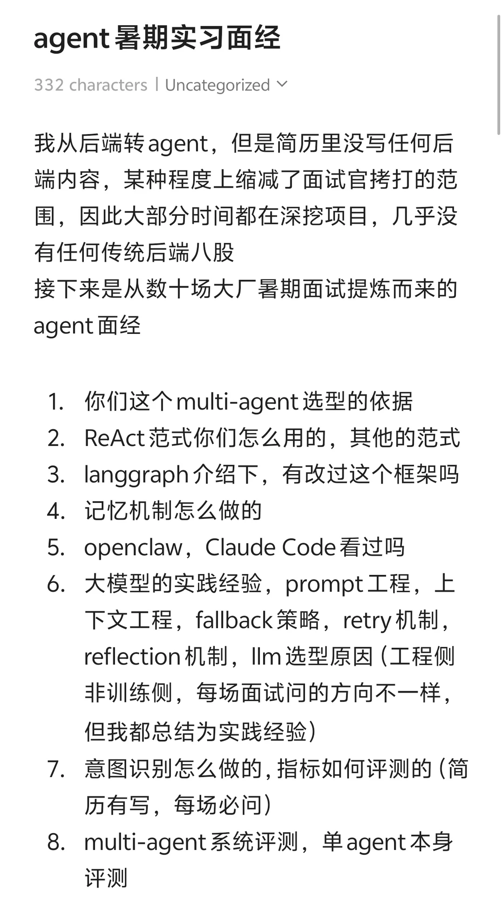

# Agent暑期实习面经

## 摘要
来源于本人这个月十几场暑期实习，总结的面经。经验是项目拷打比较深入，每个细节都问到极深极细致，也可能因此没有任何八股，唯一的八股是问进程线程协程（老面经了，今年没复习都能随便回答）
另外就是壮士断腕，为了减少拷打的难度，虽然有数段java后端实习，但是一点都没写，所以只有纯agent拷打

【评论】
shushu
佬我一直简历挂，但是感觉简历上的项目好像问题不大，可以私信让你锐评一下吗
3天前辽宁

## 正文
来源于本人这个月十几场暑期实习，总结的面经。经验是项目拷打比较深入，每个细节都问到极深极细致，也可能因此没有任何八股，唯一的八股是问进程线程协程（老面经了，今年没复习都能随便回答）
另外就是壮士断腕，为了减少拷打的难度，虽然有数段java后端实习，但是一点都没写，所以只有纯agent拷打

【评论】
shushu
佬我一直简历挂，但是感觉简历上的项目好像问题不大，可以私信让你锐评一下吗
3天前辽宁
想不出名字
可以呀
3天前上海
nora
老师 不理解为什么要做意图识别 是为了判断进入哪个workflow吗 和mcptool的工具调用区别是什么呢 还得自己检测吗
04-27江苏
想不出名字

## 图片提取文字
agent暑期实习面经
332 characters I Uncategorized 
我从后端转agent，但是简历里没写任何后
端内容，某种程度上缩减了面试官拷打的范
围，因此大部分时间都在深挖项目，几乎没
有任何传统后端八股
接下来是从数十场大厂暑期面试提炼而来的
agent面经
1．你们这个multi-agent选型的依据
2．ReAct范式你们怎么用的，其他的范式
3．langgraph介绍下，有改过这个框架吗
4.记忆机制怎么做的
5.openclaw，Claude Code看过吗
6．大模型的实践经验，prompt工程，上
下文工程，fallback策略，retry机制，
reflection机制，llm选型原因（工程侧
非训练侧，每场面试问的方向不一样，
但我都总结为实践经验
7.意图识别怎么做的，指标如何评测的（简
历有写，每场必问）
8．multi-agent系统评测，单 agent 本身
评测
## 图片
- 

## 关键信息
- **实体**: 无
- **情感**: neutral
- **质量评分**: 4.4/10

## 原文链接
[查看原文](https://www.xiaohongshu.com/explore/69ef3c9e0000000038020aaa)
