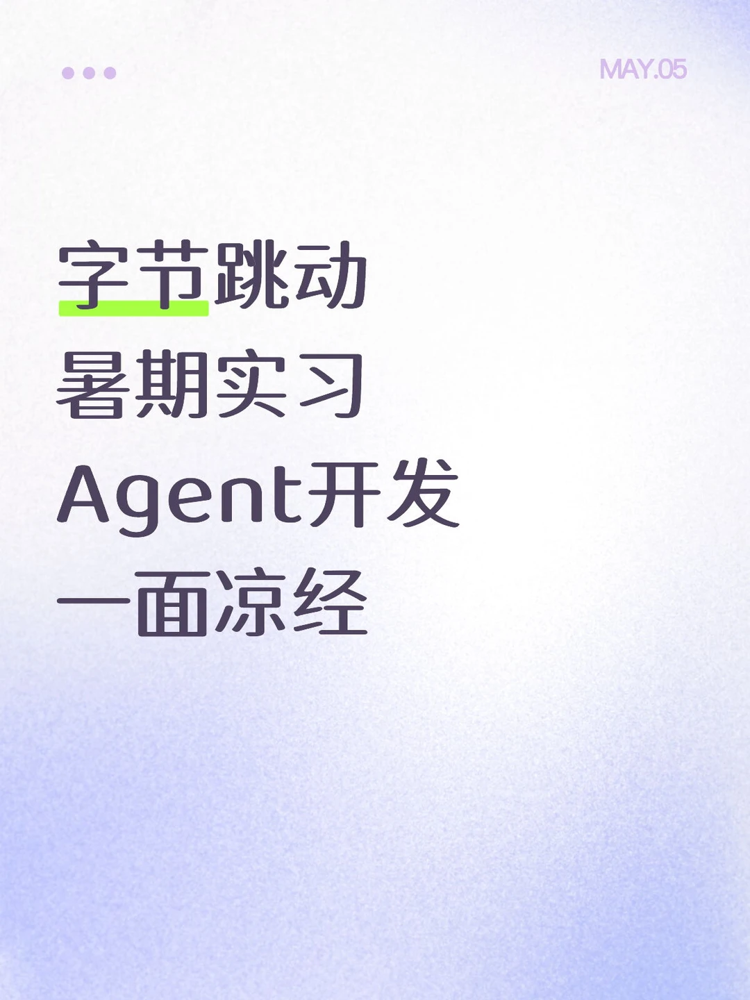
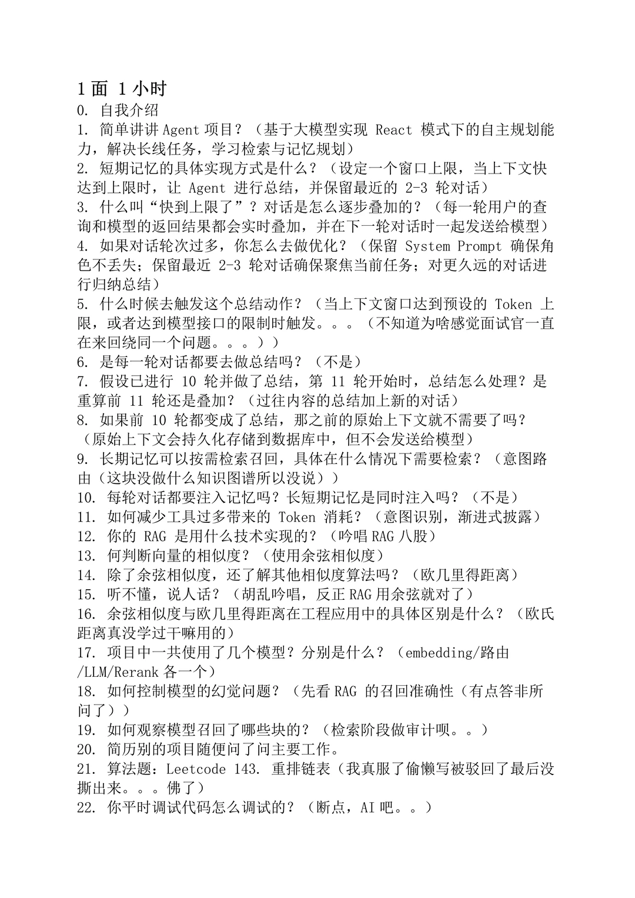

# 复盘两下

## 摘要
字节暑期实习 Agent开发一面
又被捞了，然后直接一个一面挂，再也救不回面评了
最后那个手撕，众所周知那个重排链表可以先把链表存列表里偷懒，结果写一半被面试官逮住了说你这不符合题目考察要求。。。结果标准答案又正好没背直接一个寄，然后那个链表定义 构造 输入 输出还得自己写，写了20分钟，思路和逻辑面试官都说看着没问题，结果一运行直接一个答案错误。。。早知道直接跟面试官说不会写输入输出说不定还能混

## 正文
字节暑期实习 Agent开发一面
又被捞了，然后直接一个一面挂，再也救不回面评了
最后那个手撕，众所周知那个重排链表可以先把链表存列表里偷懒，结果写一半被面试官逮住了说你这不符合题目考察要求。。。结果标准答案又正好没背直接一个寄，然后那个链表定义 构造 输入 输出还得自己写，写了20分钟，思路和逻辑面试官都说看着没问题，结果一运行直接一个答案错误。。。早知道直接跟面试官说不会写输入输出说不定还能混一混（
各位手撕题要背一定要背标答啊

【评论】
kkk
为啥我感觉up主答的也没啥问题呀面试官感觉问的东西也不算很深？
05-05广东
27暑期怨魂
手撕挂了，而且看得出来面试官自己也不太懂一些地方
05-05北京
踏歌行.
什么时候面的呀，今天不是还没开班吗
05-05陕西
27暑期怨魂

## 图片提取文字
23．不对吧，最简单的方式不是打印一下吗，你把你写的代码打印一下不
就能找一下哪个地方出问题了？（。。。。无语中）
24．最近了解的AI内容？（Openclaw，ClaudeCode源码）
25．讲一下ClaudeCode架构（胡乱吟唱）
26．建议下去再补一点Harness的知识（。。。好的）
27．反问业务（安全风险相关的AI）
MAY.05
字节跳动
暑期实习
Agent开发
一面凉经
1面1小时
0．自我介绍
1．简单讲讲Agent项目？（基于大模型实现React模式下的自主规划能
力，解决长线任务，学习检索与记忆规划）
2.短期记忆的具体实现方式是什么？（设定一个窗口上限，当上下文快
达到上限时，让Agent进行总结，并保留最近的2-3轮对话）
），
询和模型的返回结果都会实时叠加，并在下一轮对话时一起发送给模型）
4．如果对话轮次过多，你怎么去做优化？（保留SystemPrompt确保角
色不丢失；保留最近2-3轮对话确保聚焦当前任务；对更久远的对话进
行归纳总结）
5．什么时候去触发这个总结动作？（当上下文窗口达到预设的Token上
限，或者达到模型接口的限制时触发。。。（不知道为啥感觉面试官一直
在来回绕同一个问题。。。））
6．是每一轮对话都要去做总结吗？（不是）
7．假设已进行10轮并做了总结，第11轮开始时，总结怎么处理？是
重算前11轮还是叠加？（过往内容的总结加上新的对话）
8.如果前10轮都变成了总结，那之前的原始上下文就不需要了吗？
（原始上下文会持久化存储到数据库中，但不会发送给模型）
9.长期记忆可以按需检索召回，具体在什么情况下需要检索？（意图路
由（这块没做什么知识图谱所以没说））
10．每轮对话都要注入记忆吗？长短期记忆是同时注入吗？（不是）
11．如何减少工具过多带来的Token消耗？（意图识别，渐进式披露）
12.你的RAG是用什么技术实现的？（吟唱RAG八股）
13．何判断向量的相似度？（使用余弦相似度）
14．除了余弦相似度，还了解其他相似度算法吗？（欧儿里得距离）
15．听不懂，说人话？（胡乱吟唱，反正RAG用余弦就对了）
16．余弦相似度与欧几里得距离在工程应用中的具体区别是什么？（欧氏
距离真没学过干嘛用的）
17．项目中一共使用了几个模型？分别是什么？（embedding/路由
/LLM/Rerank各一个）
18．如何控制模型的幻觉问题？（先看RAG的召回准确性（有点答非所
问了））
19.如何观察模型召回了哪些块的？（检索阶段做审计呗。。）
20．简历别的项目随便问了问主要工作。
21.算法题：Leetcode143．重排链表（我真服了偷懒写被驳回了最后没
撕出来。。。佛了)
22.你平时调试代码怎么调试的？（断点，AI吧。。）
## 图片
- 
- 
- 

## 关键信息
- **实体**: 无
- **情感**: neutral
- **质量评分**: 4.4/10

## 原文链接
[查看原文](https://www.xiaohongshu.com/explore/69f9e94a0000000035038f5b)
