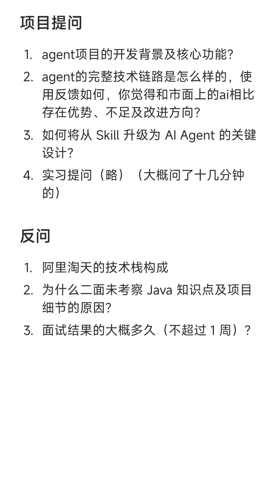
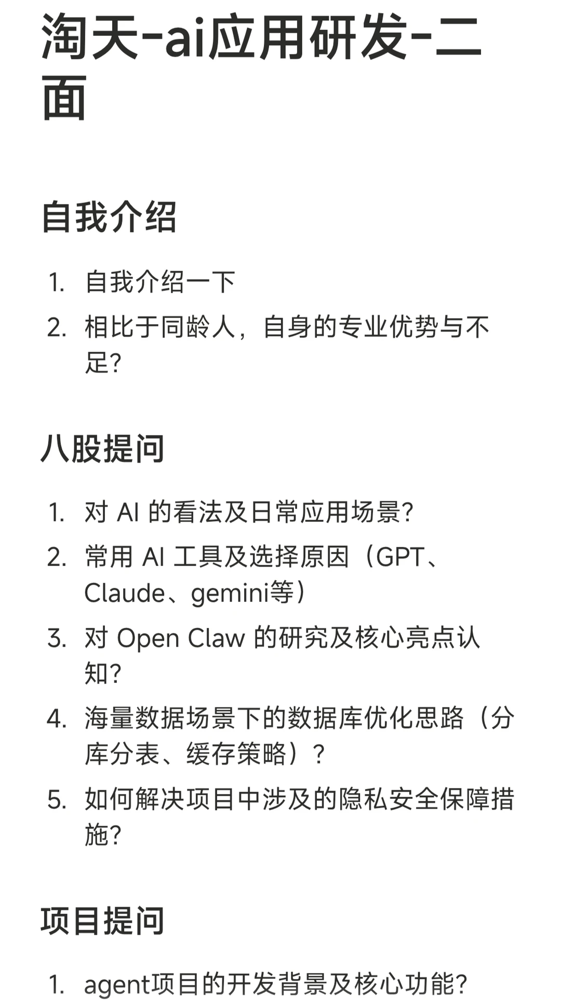

# 淘天-ai应用开发-二面

## 摘要
（全程60分钟不到，无手撕，没问常规八股，事后得知是面试官是+1）
自我介绍
1. 自我介绍一下
2. 相比于同龄人，自身的专业优势与不足？
八股提问
1. 对 AI 的看法及日常应用场景？
2. 常用 AI 工具及选择原因（GPT、Claude、gemini等）
3. 对 Open Claw 的研究及核心亮点认知？
4. 海量数据场景下的数据库优化思路（分库分表、缓存策略）？
5. 如何解决项目

## 正文
（全程60分钟不到，无手撕，没问常规八股，事后得知是面试官是+1）
自我介绍
1. 自我介绍一下
2. 相比于同龄人，自身的专业优势与不足？
八股提问
1. 对 AI 的看法及日常应用场景？
2. 常用 AI 工具及选择原因（GPT、Claude、gemini等）
3. 对 Open Claw 的研究及核心亮点认知？
4. 海量数据场景下的数据库优化思路（分库分表、缓存策略）？
5. 如何解决项目中涉及的隐私安全保障措施？
项目提问
1. agent项目的开发背景及核心功能？
2. agent的完整技术链路是怎么样的，使用反馈如何，你觉得和市面上的ai相比存在优势、不足及改进方向？
3. 如何将从 Skill 升级为 AI Agent 的关键设计？
4. 实习提问（略）（大概问了十几分钟的）
反问
1. 阿里淘天的技术栈构成
2. 为什么二面未考察 Java 知识点及项目细节的原因？
3. 面试结果的大概多久（不超过 1 周）？

【评论】
qinyu啊
想问问所以为啥不考察java呀
4天前浙江
白衣胜雪丶
一面考察过了
4天前浙江
明年打到4.0
请问这个是p几的面试？
昨天 02:22美国
白衣胜雪丶

## 图片提取文字
项目提问
1．agent项目的开发背景及核心功能？
2．agent的完整技术链路是怎么样的，使
用反馈如何，你觉得和市面上的ai相比
存在优势、不足及改进方向？
3.如何将从 Skill 升级为Al Agent的关键
设计？
4．实习提问（略）（大概问了十几分钟
的）
反问
1.阿里淘天的技术栈构成
2.为什么二面未考察Java知识点及项目
细节的原因？
3．面试结果的大概多久（不超过1周）？
淘天-ai应用研发-二
面
自我介绍
1.自我介绍一下
2.相比于同龄人，自身的专业优势与不
足？
八股提问
1.对AI的看法及日常应用场景？
2.常用AI工具及选择原因（GPT、
Claude、gemini等)
3.对OpenClaw的研究及核心亮点认
知？
4.海量数据场景下的数据库优化思路（分
库分表、缓存策略）？
5.如何解决项目中涉及的隐私安全保障措
施？
项目提问
agent项目的开发背景及核心功能？
1.2
## 图片
- 
- 

## 关键信息
- **实体**: 无
- **情感**: neutral
- **质量评分**: 3.0/10

## 原文链接
[查看原文](https://www.xiaohongshu.com/explore/6a00a7740000000007013726)
