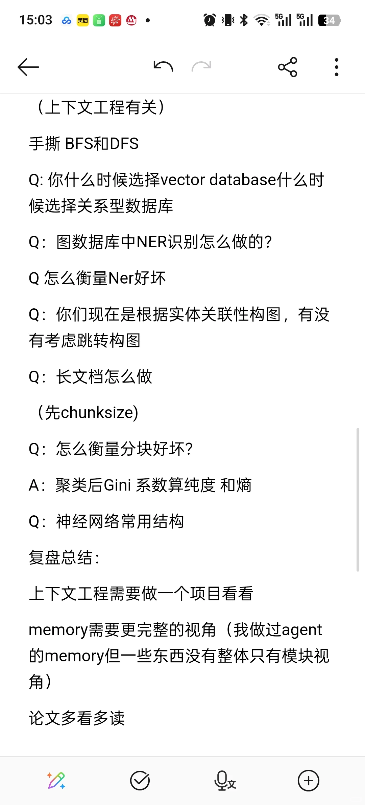
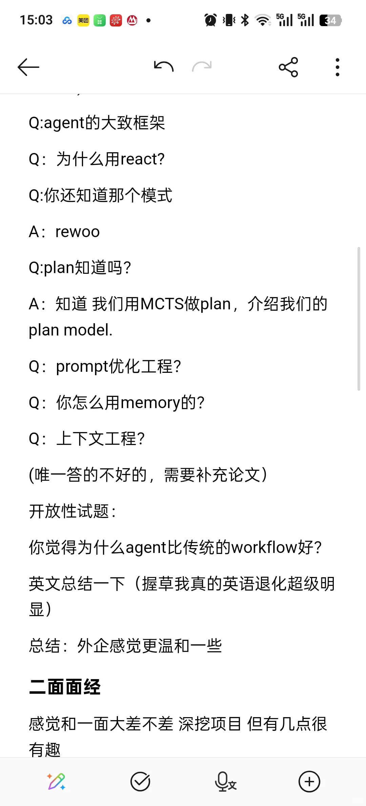
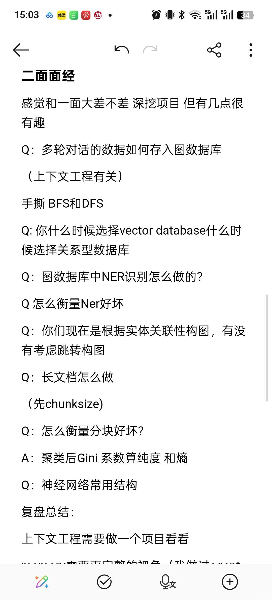

# 社招复盘（一）

## 摘要
【评论】
踏踏它塔塔
请问博主agent这块儿社招好找吗
01-08北京
sher
不清楚 bg不一样感觉不好说
01-08上海
蜉蝣
方面透露一下这个岗位的薪资范围吗，我年后也打算看看外企机会了
01-08广东
sher

## 正文
【评论】
踏踏它塔塔
请问博主agent这块儿社招好找吗
01-08北京
sher
不清楚 bg不一样感觉不好说
01-08上海
蜉蝣
方面透露一下这个岗位的薪资范围吗，我年后也打算看看外企机会了
01-08广东
sher

## 图片提取文字
15:03知*·
&。
个
:
(上下文工程有关）
手撕BFS和DFS
Q:你什么时候选择vector database什么时
候选择关系型数据库
Q：图数据库中NER识别怎么做的?
Q怎么衡量Ner好坏
Q：你们现在是根据实体关联性构图，有没
有考虑跳转构图
Q：长文档怎么做
(先chunksize)
Q：怎么衡量分块好坏？
A：聚类后Gini系数算纯度和熵
Q：神经网络常用结构
复盘总结：
上下文工程需要做一个项目看看
memory需要更完整的视角（我做过agent
的memory但一些东西没有整体只有模块视
角)
论文多看多读
D
?
15:03美
℃0
个
：
2025/12/3118:02丨596字丨默认笔记本
外企agent面经
一面面经
自我介绍问项目
Q：意图识别怎么做的？
Q：为什么选这个模型，怎么优化的
Q：介绍下BM算法
Q：为什么采用graphrag
Q:怎么做知识图谱构造的？
Q：如何做RAG的?
Q：图谱的好处是什么？（说了Linkedln
search)
Q:agent的大致框架
Q：为什么用react?
Q:你还知道那个模式
A: rewoo
Q:plan知道吗?
A：知道我们用MCTS做plan，介绍我们的
D
+
15:03の知M
↑
℃
Q:agent的大致框架
Q：为什么用react?
Q:你还知道那个模式
A: rewoo
Q:plan知道吗?
A：知道我们用MCTS做plan，介绍我们的
plan model.
Q：prompt优化工程?
Q：你怎么用memory的?
Q：上下文工程?
(唯一答的不好的，需要补充论文)
开放性试题：
你觉得为什么agent比传统的workflow好?
英文总结一下（握草我真的英语退化超级明
显)
总结：外企感觉更温和一些
二面面经
感觉和一面大差不差深挖项目但有几点很
有趣
D
?
15:03の美·
 5l  34
二面面经
感觉和一面大差不差深挖项目但有几点很
有趣
Q：多轮对话的数据如何存入图数据库
(上下文工程有关)
手撕BFS和DFS
Q:你什么时候选择vector database什么时
候选择关系型数据库
Q：图数据库中NER识别怎么做的?
Q怎么衡量Ner好坏
Q：你们现在是根据实体关联性构图，有没
有考虑跳转构图
Q：长文档怎么做
(先chunksize)
Q：怎么衡量分块好坏?
A：聚类后Gini系数算纯度 和熵
Q：神经网络常用结构
复盘总结：
上下文工程需要做一个项目看看
D
文
+
## 图片
- 
- 
- 
- 

## 关键信息
- **实体**: 无
- **情感**: neutral
- **质量评分**: 4.1/10

## 原文链接
[查看原文](https://www.xiaohongshu.com/explore/695f570a000000000d00bb0d)
