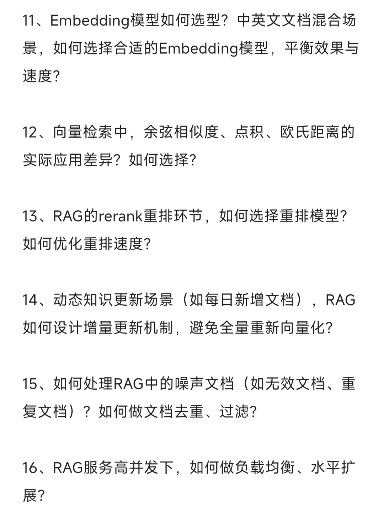
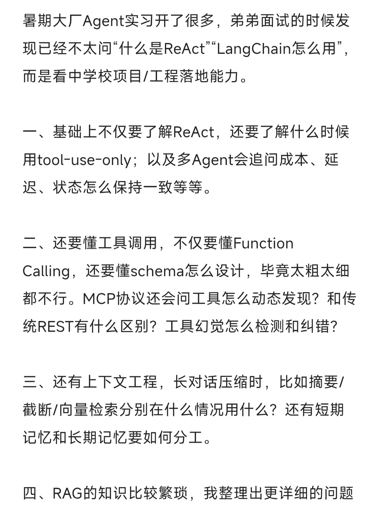
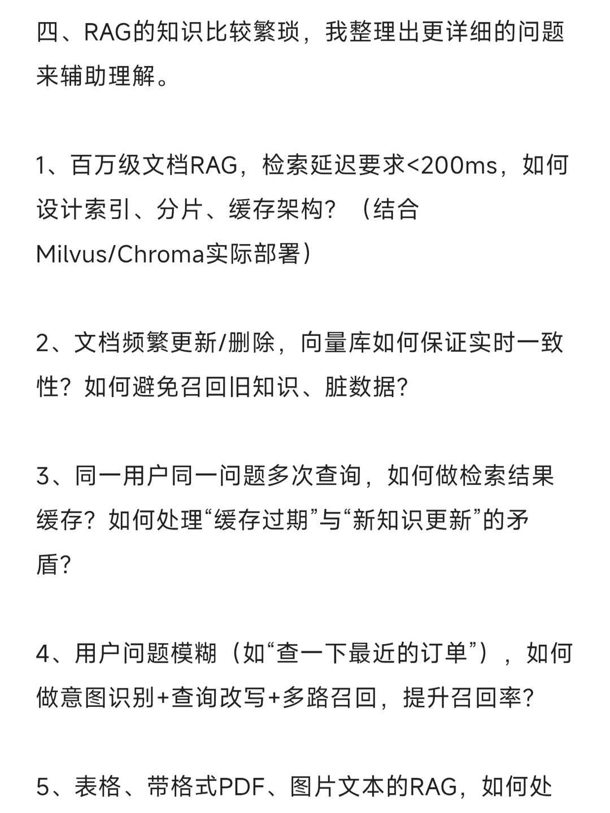
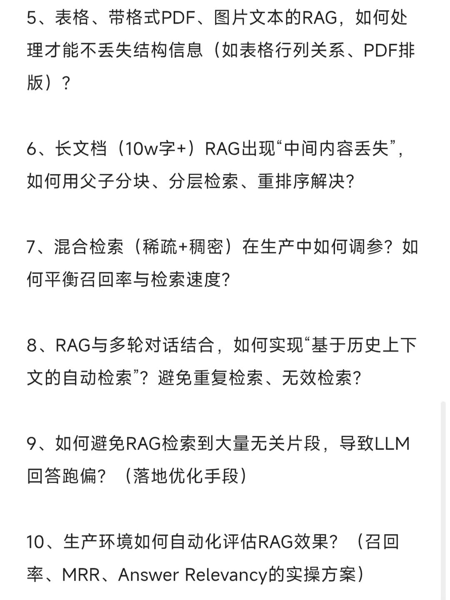

# 近三个月大厂Agent实习面试都在问什么

## 摘要
【评论】
去码头整點薯条
主播，agent开发岗会问到java的那些中间件相关八股
05-07北京
小怪兽没名字（求职中）
我感觉会被问到的，但问法、侧重点、深度肯定不一样。你可以看看这部分的问法，之前我好像看见过
05-08辽宁
- THE END -

## 正文
【评论】
去码头整點薯条
主播，agent开发岗会问到java的那些中间件相关八股
05-07北京
小怪兽没名字（求职中）
我感觉会被问到的，但问法、侧重点、深度肯定不一样。你可以看看这部分的问法，之前我好像看见过
05-08辽宁
- THE END -

## 图片提取文字
11、Embedding模型如何选型？中英文文档混合场
景，如何选择合适的Embedding模型，平衡效果与
速度？
12、向量检索中，余弦相似度、点积、欧氏距离的
实际应用差异？如何选择？
13、RAG的rerank重排环节，如何选择重排模型？
如何优化重排速度？
14、动态知识更新场景（如每日新增文档），RAG
如何设计增量更新机制，避免全量重新向量化？
15、如何处理RAG中的噪声文档（如无效文档、重
复文档）？如何做文档去重、过滤？
16、RAG服务高并发下，如何做负载均衡、水平扩
展？
暑期大厂Agent实习开了很多，弟弟面试的时候发
现已经不太问"什么是ReAct”"LangChain怎么用”，
而是看中学校项目/工程落地能力。
一、基础上不仅要了解ReAct，还要了解什么时候
用tool-use-only；以及多Agent会追问成本、延
迟、状态怎么保持一致等等。
二、还要懂工具调用，不仅要懂Function
Calling，还要懂schema怎么设计，毕竟太粗太细
都不行。MCP协议还会问工具怎么动态发现？和传
统REST有什么区别？工具幻觉怎么检测和纠错？
三、还有上下文工程，长对话压缩时，比如摘要/
截断/向量检索分别在什么情况用什么？还有短期
记忆和长期记忆要如何分工。
四、RAG的知识比较繁琐，我整理出更详细的问题
来辅助理解。
1、百万级文档RAG，检索延迟要求<200ms，如何
设计索引、分片、缓存架构？（结合
Milvus/Chroma实际部署）
2、文档频繁更新/删除，向量库如何保证实时一致
性？如何避免召回旧知识、脏数据？
3、同一用户同一问题多次查询，如何做检索结果
缓存？如何处理“缓存过期”与“新知识更新”的矛
盾？
4、用户问题模糊（如“查一下最近的订单"），如何
做意图识别+查询改写+多路召回，提升召回率？
5、表格、带格式PDF、图片文本的RAG，如何处
理才能不丢失结构信息（如表格行列关系、PDF排
版)?
6、长文档（10w字+）RAG出现“中间内容丢失”，
如何用父子分块、分层检索、重排序解决？
7、混合检索（稀疏+稠密）在生产中如何调参？如
何平衡召回率与检索速度？
8、RAG与多轮对话结合，如何实现“基于历史上下
文的自动检索”？避免重复检索、无效检索？
9、如何避免RAG检索到大量无关片段，导致LLM
回答跑偏？（落地优化手段）
10、生产环境如何自动化评估RAG效果？（召回
率、MRR、AnswerRelevancy的实操方案）
## 图片
- 
- 
- 
- 

## 关键信息
- **实体**: 无
- **情感**: neutral
- **质量评分**: 3.4/10

## 原文链接
[查看原文](https://www.xiaohongshu.com/explore/69fc5a350000000022028893)
