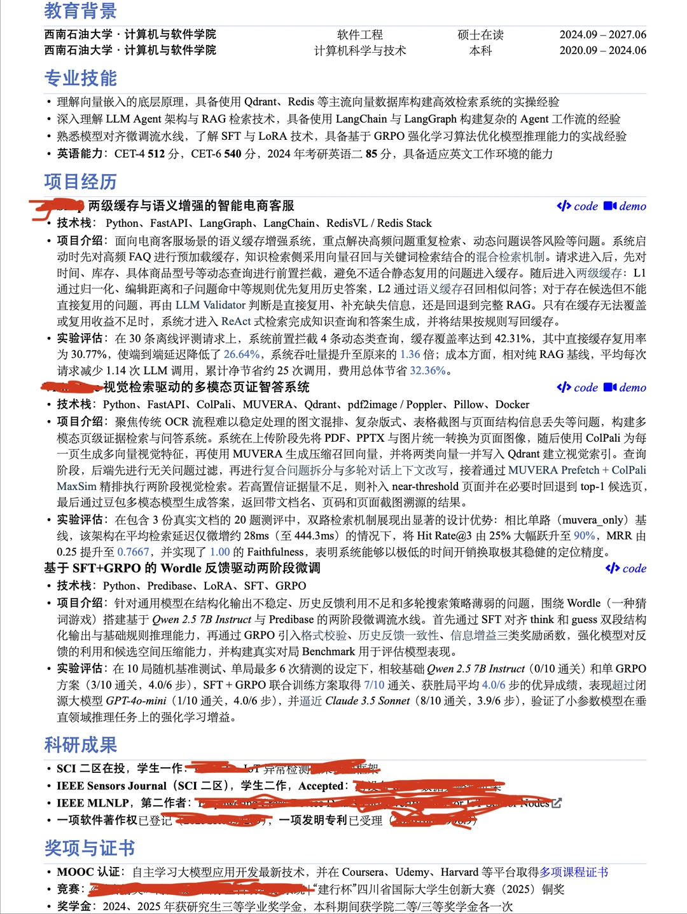

# 大模型应用/Agent开发简历求批，刚投两天

## 摘要
一位双非本硕背景的求职者，在从C++开发转向Agent开发后，制作了三个项目并开始投递实习简历。帖子反映了当前AI应用开发岗位求职的挑战，包括HR回复率低、竞争激烈等问题，但也获得了面试机会。评论区有鼓励也有质疑，整体氛围中性偏焦虑。

## 正文
## 正文

bg 双非本硕，看过我之前帖子的人都知道，我是在 3 月底投 cpp 开发不顺的情况下转到 agent 开发的，学习了一个多月，做了 3 个项目，微调那个项目会 toy 一些，其它两个都是自己构思然后 ai 辅助编程完成的，劳动节结束后开始投递简历，大家看看大概能找到什么样的实习呢。现在我发现 boss 上面好多 hr 都不看消息了，看了消息后大多数也没有回复，所以有点儿焦虑，不过目前还是拿到了一家公司的面试，希望有好运吧。

## 评论区

**想什么来什么**  
是不是找到实习了？看你主页在求租房  
1小时前 安徽

**CloudRiver**  
双非硕+agent=死罪  
1小时前 安徽

**想什么来什么**  
（置顶评论）  
昨天 18:14 四川

## 图片
- 

## 关键信息
- **实体**: 双非本硕, C++开发, Agent开发, Boss直聘
- **情感**: neutral
- **质量评分**: 7.5/10

## 原文链接
[查看原文](https://www.xiaohongshu.com/explore/69feace6000000002202ac5d)
