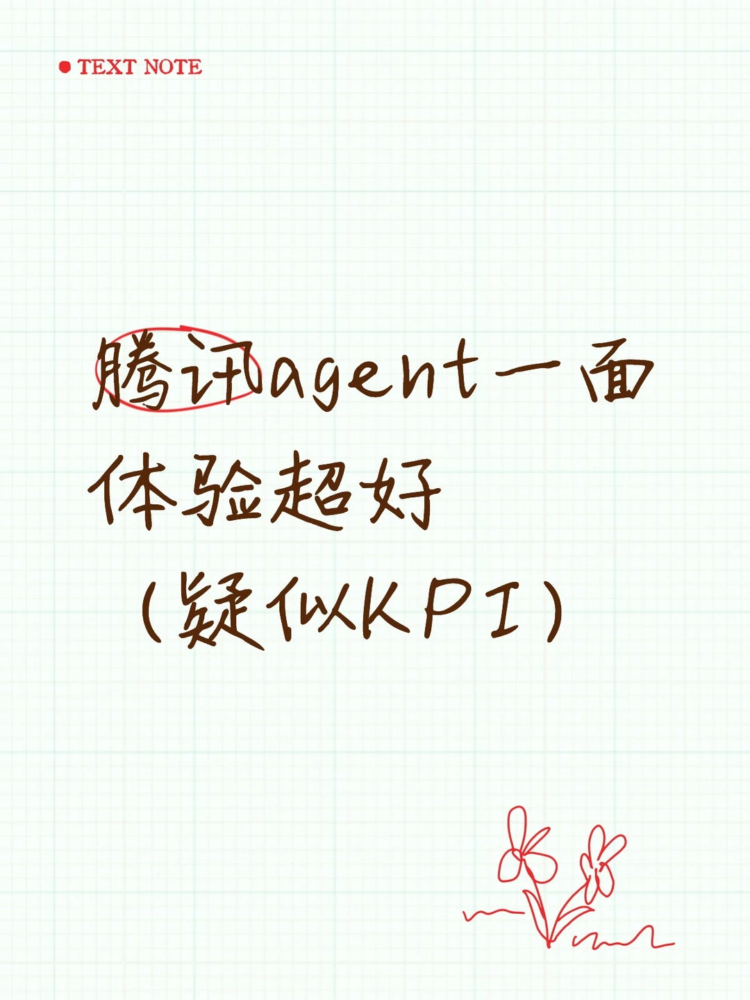

# 暑期腾讯一面面经

## 摘要
这是一篇关于腾讯暑期实习面试的经验分享，主要针对AI应用开发岗位。面试官重点考察了项目经验，特别是LLM设计、RAG技术、模型训练与优化等细节，没有涉及八股文。面试过程互动性强，面试官会给出自己的见解和建议。作者还分享了代码环节的选择和反问环节的收获。帖子获得了较高的互动量，对准备大厂面试的求职者有参考价值。

## 正文
腾讯agent一面 体验超好
只问项目没有八股，感觉面试官更感兴趣模型训练和优化
1.追问项目细节并以此进行延伸，LLM部分是怎么设计的？
2.有没有部署过大模型？
3.项目中对话流程是什么？
4.如果面试官和AI对话生成的问题冲突怎么办？
5.如果将项目升级为虚拟对话可以怎么改
6.实习的这个项目还有哪些需要优化的
到此第一段实习问题结束，可能有些问题遗漏，而且我没提到的解决办法面试官都阐述出来了他的想法。
7.你的这些实习项目哪些用到了rag
8.rag的信息是怎么存储的
9.用的哪些embedding模型
10.embedding是怎么分chunk的
11.硬切分在实践中有哪些弊端吗，有没有实际的例子
12.选一个项目介绍一下react机制是怎么设计的，在实际应用场景表现如何
13.这些项目哪个更适合使用模型再训练，哪些适合用rag
14.微调的数据集从哪里来
这里我选的项目和面试官想听的有偏差，面试官也说了他的选择策略，收获很多。
代码环节我婉拒了手撕self-attention和检测模型，最后选了leetcode一道题
反问组里的业务和对于agent岗位我还有哪些提升的地方

【评论】
秦川楚客
请问岗位名称是什么
04-01陕西
日青
我投的AI应用开发 但是是软件全栈开发捞的我[呃R]
04-01北京
moYa
我昨天也是 投的应用开发 结果面的全栈开发
04-04江苏
日青

## 图片提取文字
（无）

## 图片
- 

## 关键信息
- **实体**: 腾讯, AI应用开发, RAG, LLM, self-attention
- **情感**: positive
- **质量评分**: 8.5/10

## 原文链接
[查看原文](https://www.xiaohongshu.com/explore/69cbee68000000001a02218e)
