# 腾讯大模型应用开发 二面

## 摘要
该帖子分享了腾讯大模型应用开发岗位的二面经历，评论区反映了面试难度较高，涉及从零设计coding agent等复杂问题。用户讨论了大模型应用开发与agent面试的难度差异，以及企业对应聘者从0设计经验的要求。帖子标签包括面试、面经、AI、agent、实习，互动数据较高，表明内容受到关注。

## 正文
【评论】
Zuko
感觉这些问题好难，属于从0设计一个coding agent才能会的啊！或者就是提前知道要问什么，好好背背
04-26江苏
小红薯68AC21D7
唉 现在企业大部分都要求有从0设计的经验
3天前浙江
momo
agent面试好难如果是大模型应用开发岗会简单一些吗
1天前湖北
AI 超个体孵化器（招远程实习）

## 图片提取文字
?13.你觉得二面和一面在Al
Agent方向上最大的区别
是什么？
一面很多时候还会看你知不知道概念，比如
RAG、Tool Calling、Memory、Multi-
Agent这些名词你能不能说清。二面通常就
不满足于名词解释了，它更想知道你能不能
把这些东西真正落到系统里。也就是说，它
会追着问边界条件、失败案例、线上治理和
设计取舍。不是问你“会不会”，而是问你“为
什么这么做，不这么做会出什么问题”。如果
你答的时候一直停留在定义层面，二面一般
很容易被看出来。
15
16
22
23
28
00
30
腾讯大模型应用开
发二面
AI速览本文讨论了腾讯大模型应用开发二「>
时间4.3
1。
如果让你设计一个Agent的
规划器，怎么避免它每一步
都重新规划，导致路径震
荡？
都重新规划，导致路径震
荡？
规划器不能每拿到一个observation就整体
重算，不然很容易出现前一步刚决定检索，
后一步又改成总结，再下一步又回去检索，
整个执行路径会来回抖动。更稳的做法是把
规划分成“全局计划”和“局部调整”两层。全
局计划只定义阶段目标，比如信息收集、证
据校验、结果生成；局部调整只允许在当前
阶段内微调具体动作。另外要给planner一
个明确的状态表示，比如当前子目标、已完
成步骤、失败原因、剩余预算。如果没有状
态约束，模型会把每次新observation当成
全新任务来理解。线上一般还会加“重规划
值”，只有在关键前提失效、连续失败或者用
户自标变化时才允许重规划，这样路径会稳
定很多。
2．如果一个Agent需要同时读
知识库、调外部API、再结
=
合用户历史偏好回答，你怎
么处理这三类上下文的优先
级？
这三类信息不能混看喂，要先定义优先级。
通常系统规则最高，接下来是当前轮用户明
确输入，再往下是外部工具返回和知识库证
据，用户历史偏好通常最低。因为偏好只能
影响表达方式或默认选择，不能覆盖当前轮
事实。比如用户历史里一直偏好Python，但
这轮明确说“用Java给我写”，那当前轮约束
一定优先。又比如知识库里有旧规则，外部
API返回的是实时状态，那实时状态优先于
静态知识。真正做 prompt组装时，最好按
槽位拼接，把“当前目标”“实时证据”“历史画
像”分开，而不是混成一段自然语言。
3.你怎么理解Agent里的“状
态”而不是“上下文”？
上下文更像模型看到的输入材料，状态则是
系统对任务推进过程的结构化刻画。Agent
做得深一点以后，不能只靠大段对话历史维
持执行，因为模型并不天然擅长长期状态一
致性。状态通常包括当前阶段、已完成子任
务、失败次数、已调用工具、关键中间结
果、待确认信息这些。这样做的好处是，模
型不用每次从自然语言里自己猜任务进行到
哪一步，系统可以明确告诉它现在在什么节
点。很多所谓Agent不稳定，本质上不是上
下文不够，而是没有显式状态。
?4.如果RAG召回了很多相互矛
盾的文档，Agent应该怎么处
理，而不是直接让模型自己总
=
结？
不能直接把予盾文档一股脑去给模型让它自
己“综合”，那样很容易生成一个看起来圆滑
但实际上没有依据的答案。更合理的做法是
先做证据归一化和冲突检测。比如先按来
源、时间、可信度分组，再抽取同一个字段
的不同取值，看冲突是时间差异导致的，还
是来源本身互相打架。如果是时间敏感信
息，通常新版本优先；如果是来源权威性不
同，官方文档优先；如果还是无法消解，就
应该明确告诉用户存在冲突，并说明目前更
可信的依据是什么。Agent在这里更像证据
调解器，而不是方能总结器。
可信的依据是什么。Agent在这里更像证据
调解器，而不是万能总结器。
·5.如果工具调用是成功的，但返
回结果语义不完整，模型很容易
误判，你怎么设计中间层？
这个问题非常常见。很多工具从接口层面看
是200成功，但业务语义上其实不够用，比
如只返回了一个code，没有返回解释信息；
或者字段含义不清，模型会自行脑补。解决
方式一般是加一个tooladapter或
semanticwrapper，把原始结果转成统一、
可解释的中间表示。也就是说，不要把外部
API的脏数据直接回喂给模型，而是先在中
间层做字段补全、错误码翻译、单位归一、
空值处理和置信度标注。这样模型看到的是
“可推理对象”，而不是原始接口垃圾。
‘可推理对象”，而不是原始接口垃圾。
6．一个Agent系统里，什么时
候应该追问用户，什么时候
应该自己继续推理？
判断标准主要有两个：信息缺口是否影响正
确执行，以及这个缺口能不能通过工具或外
部知识补上。如果缺的是执行必需参数，比
如查订单必须要订单号，那就应该追问用
户；如果缺的是可由外部系统补齐的背景信
息，比如天气查询里城市能从用户画像里拿
到，那可以自己继续推理。还有一种情况是
虽然能猜，但猜错代价很高，比如支付、发
送、删除这类动作，一般宁愿追问，也不要
擅自补全。所以追问不是因为模型“不聪
明”，而是因为系统要在体验和风险之间做平
衡。
衡。
·7．如果模型特别擅长生成，但
不擅长严格遵守流程，你会
怎么把它放进一个强约束工
作流里？
最常见的办法就是把“生成自由度”和“流程控
制权"拆开。模型只负责局部判断和内容生
成，流程推进由外部状态机控制。比如工作
流规定必须先做参数校验，再检索知识，再
调用工具，最后生成答复。模型不能跳步，
能做的只是当前节点下的判断，例如“检索关
键词怎么改写”“看到这些证据后怎么总结”。
这样一来，模型仍然发挥语言理解优势，但
不会破坏整体流程。真正线上稳定的
Agent，很多都不是纯模型自治，而是“系统
控流程，模型控局部智能”。
Agent，很多都不是纯模型自治，而是“系统
控流程，模型控局部智能”
·8．你怎么设计Agent的失败恢
复机制？
失败恢复不能只理解成“报错后重试”。
Agent的失败通常分成好几类：工具超时、
参数错误、依赖数据缺失、模型误判、外部
系统状态变化。不同类型恢复方式不一样。
如果是临时性错误，比如接口超时，可以限
次重试；如果是参数缺失，就该回到追问节
点；如果是模型连续选错工具，就要触发降
级策略，比如改成规则路由或者人工兜底；
如果是外部系统不可用，就要及时终止并返
回清晰失败原因。恢复机制一定要和状态机
绑定，不能让模型自己“觉得应该再试一
下”，不然很容易进入无穷重试

## 图片
- 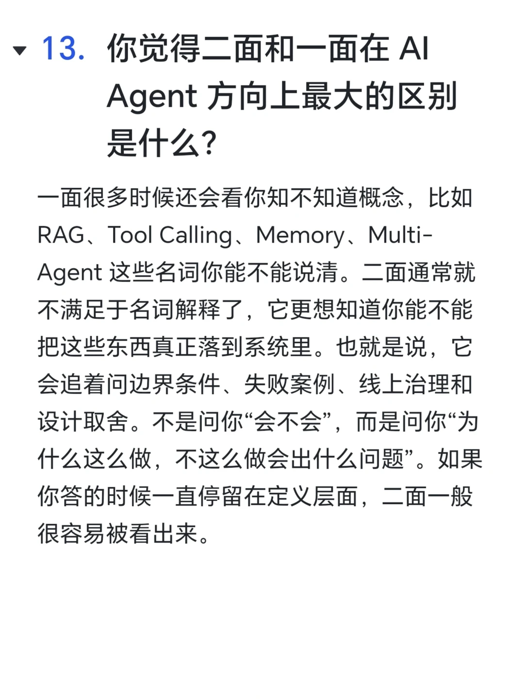
- 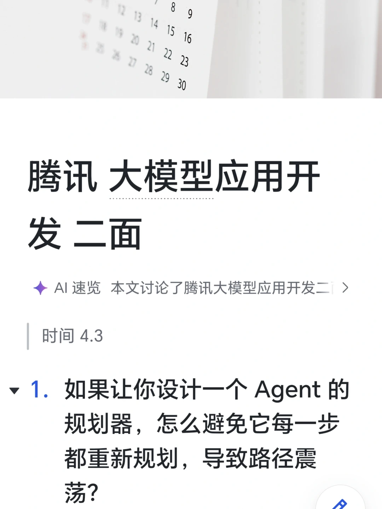
- 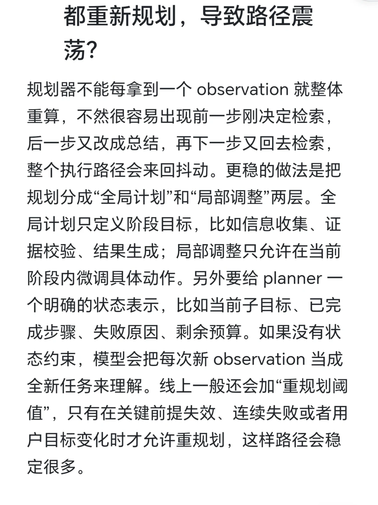
- 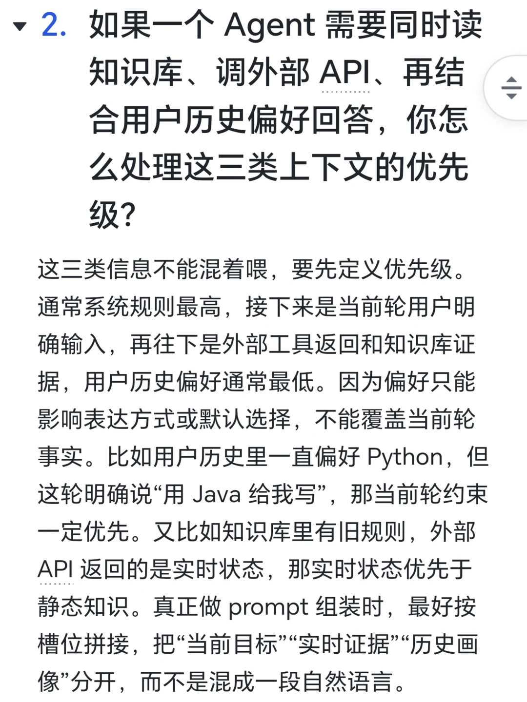
- 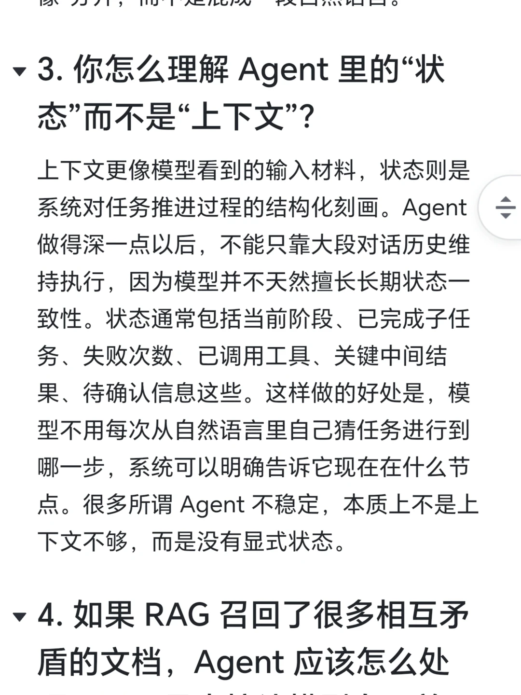
- 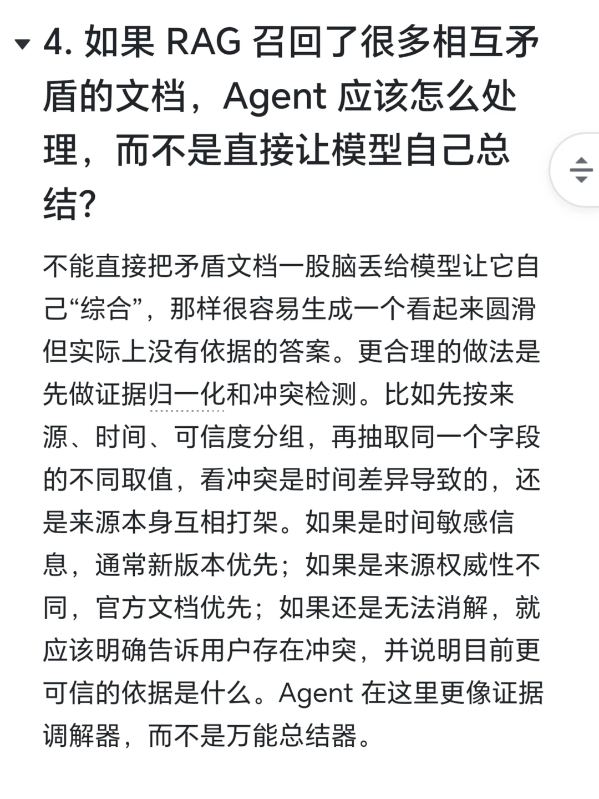
- 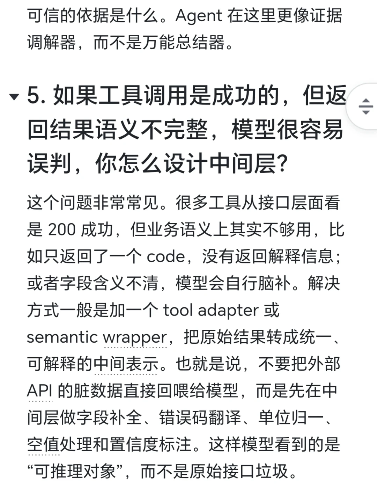
- 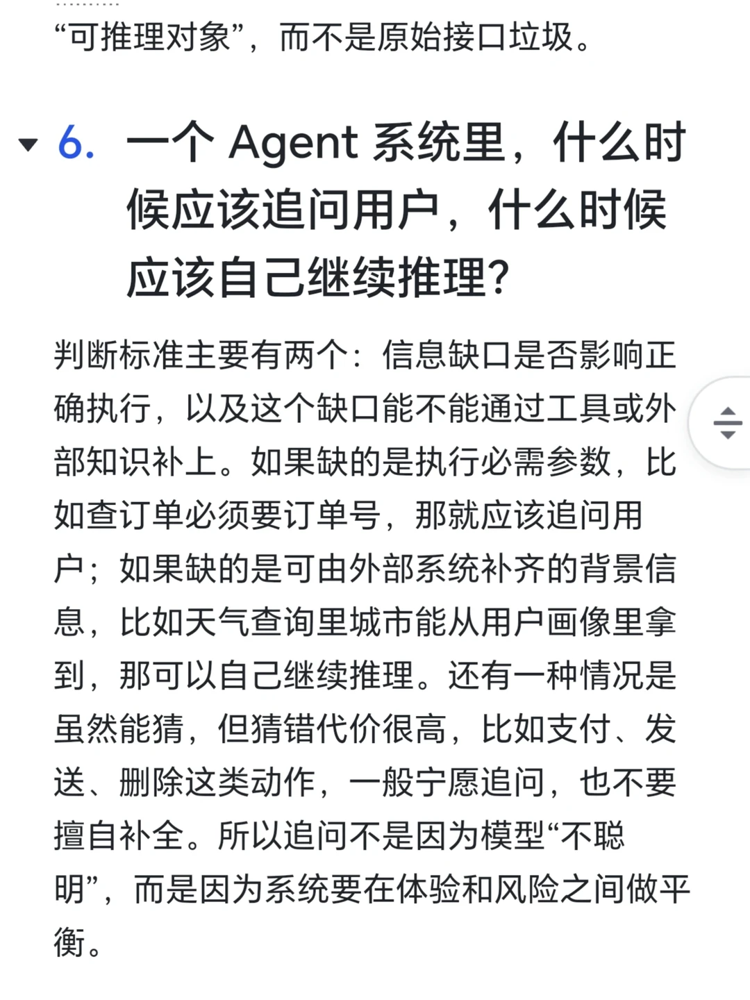
- 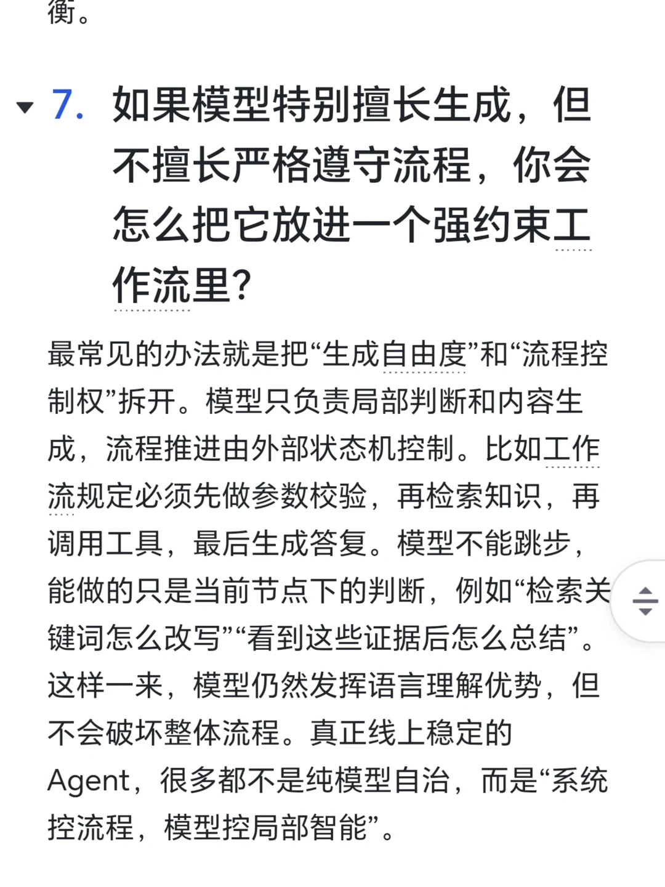
- 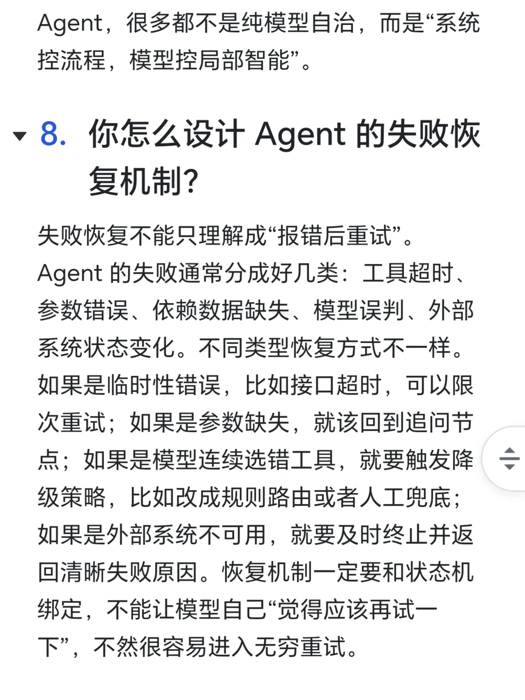
- 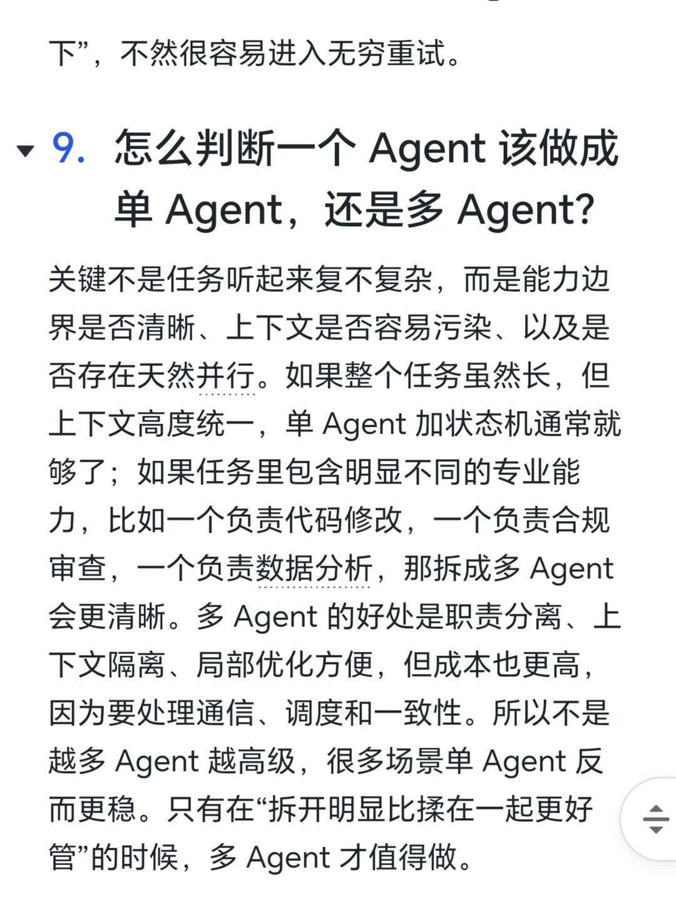
- 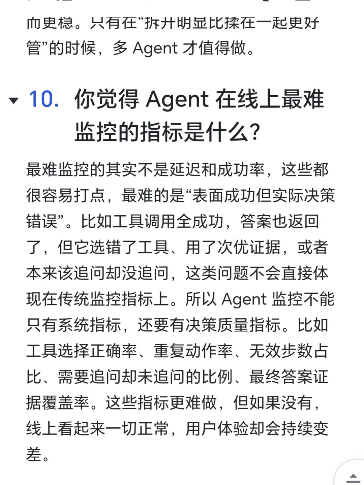
- 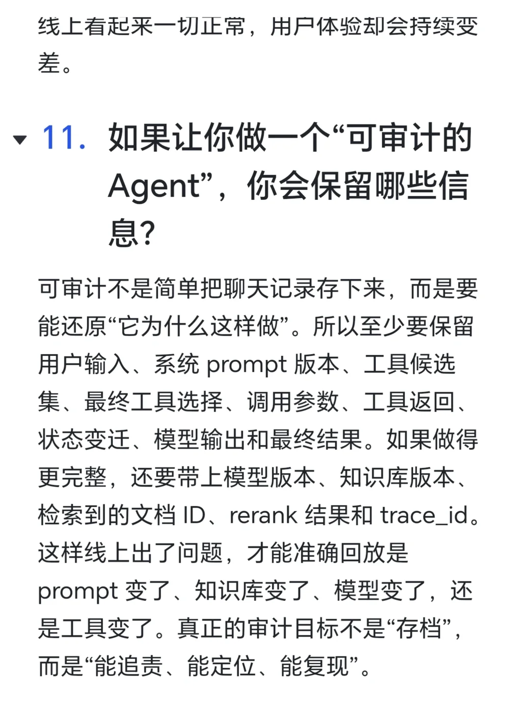
- 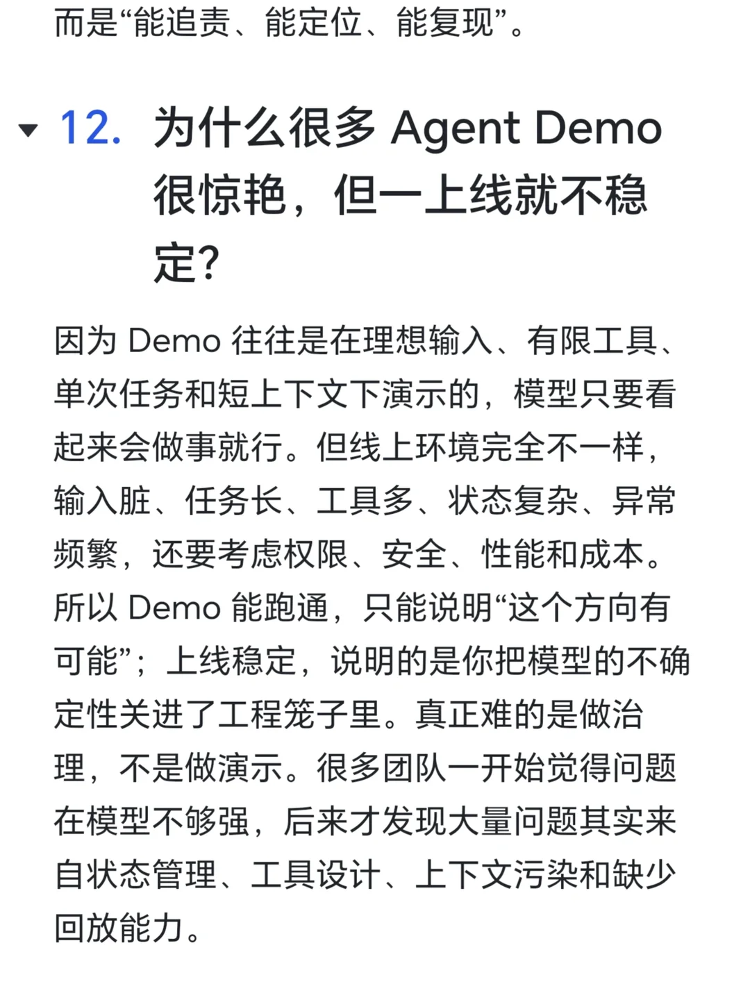

## 关键信息
- **实体**: 腾讯, Zuko, 小红薯68AC21D7, momo, AI 超个体孵化器（招远程实习）
- **情感**: neutral
- **质量评分**: 6.5/10

## 原文链接
[查看原文](https://www.xiaohongshu.com/explore/69db6240000000001a022787)
