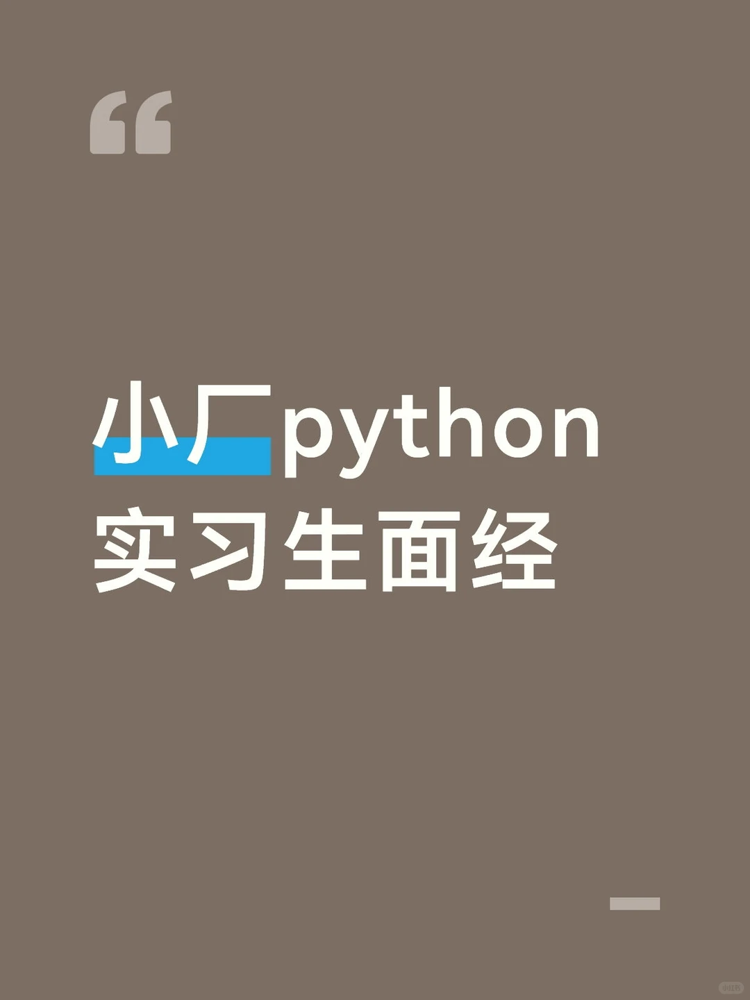

# 非常有收获的一次面试

## 摘要
这是一篇关于Python实习生面试的详细面经分享。作者描述了在一家500人左右的小公司面试RPA开发岗位的全过程，包括笔试、一面、二面和HR面。笔试涉及Python八股、MySQL和前端知识；一面简短，主要考察Python基础；二面是压力面，面试官基于简历出场景题，考察了内存管理、数据加密、环境管理等实际问题；HR面真诚友好。整体面试体验良好，但工资较低、公司环境一般。帖子提供了实用的面试经验和准备建议。

## 正文
## 小Python 实习生面经

### 面试流程

500人左右的小公司，boss上投递，hr推进非常快，当天发笔试。

#### 笔试
一些python八股、mysql、前端知识。线上做的难度中等偏易。当天通过约一面。

#### 一面线上（13min）一位面试官
面试官迟到了5min，问了一些python八股，例如get和post、深拷贝浅拷贝、装饰器生成器、git冲突等，非常简单。当天就过了。python八股可以看这位老师@燕生置顶的笔记，每次考的都是这些。

#### 二面线下（40min）一位面试官
面的最满意的一次，面试官有在认真考察你，感受到被尊重了，我很喜欢压力面！
面试官全程基于简历出场景题，没有八股和手撕环节。面试题有深度，很多问题我都没思考过。比如内存爆满、数据加密、环境管理、客户需求等。比如如何从0-1构建一个xxx项目，具体哪些命令哪些包。里面如果出现一些具体的异常操作怎么处理等等。主包也是绞尽脑汁回答了。

#### hr面（25min）
hr谈吐也是令人感到非常舒服，很真诚。告知了具体的公司业务，以及刚刚的面试结果通过了。

### 总结
整体来说工作内容挺满意的，面试体验也很好，公司离学校也特别近。但是工资有点低，以及公司环境不太美妙。

#面经 #rpa开发 #python #研究生 #实习 #开发

编辑于 04-17 浙江

---

### 评论区

- **阿这**：面的是后端吗还是agent开发 (04-17 四川)
- **谁抢了我的offer**：ai+rpa开发 (04-17 浙江)
- **柳潜江**：主包主包我要追随你 (04-17 江苏)
- **谁抢了我的offer**：(回复)

## 图片提取文字
小python
实习生面经
## 图片
- 

## 关键信息
- **实体**: 燕生, boss直聘, 浙江
- **情感**: positive
- **质量评分**: 8.5/10

## 原文链接
[查看原文](https://www.xiaohongshu.com/explore/69e18daf000000002202405a)
